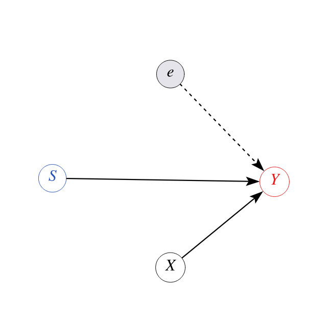
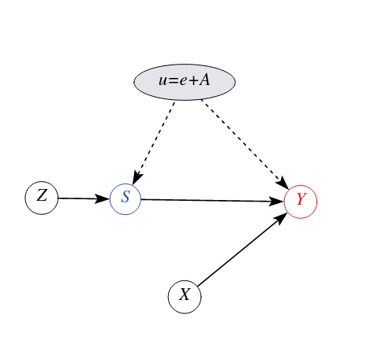

layout: true

<div class="my-footer"></div> 

---

```{r setup, include=FALSE,warning=FALSE,message=FALSE}
options(htmltools.dir.version = FALSE)
knitr::opts_chunk$set(
    echo = FALSE,
    message = FALSE,
    warning = FALSE,
    dev = "svg",
    cache = TRUE,
    fig.align = "center"
    #fig.width = 11,
    #fig.height = 5
)

# define vars
library(magrittr)
library(broom)
library(estimatr)
library(modelsummary)
library(ggplot2)
gm = modelsummary::gof_map
gm$omit <- TRUE
gm$omit[gm$clean == "R2 Adj."] <- FALSE
gm$omit[gm$clean == "Num.Obs."] <- FALSE
gom = "p.value.|se_type|statistic.end|statistic.overid|statistic.weakinst"

```

# Status

.pull-left[

## O que fizemos na semana passada?

* Aprendemos sobre o grande experimento de John Snow em Londres em 1850.

* Usamos sua história para motivar o estimador IV.

* Você fez um quiz sobre alguns aspectos do IV.

]


--

.pull-right[

## Hoje

* Veremos outras aplicações IV.

* Introduzimos uma extensão chamada *Two Stage Least Squares*.

* Usaremos `R` para calcular as estimativas.

* Finalmente falaremos sobre instrumentos *fracos*.

]

---

# Retornos da Escolaridade

.pull-left[
* Qual é o impacto causal da escolaridade sobre os rendimentos?

* [Jacob Mincer](https://en.wikipedia.org/wiki/Jacob_Mincer) estava interessado nesta importante questão.

* Aqui está o modelo dele:

$$
\log Y_i = \alpha + \rho S_i + \beta_1 X_i + \beta_2 X_i^2 + e_i
$$
]


.pull-right[
```{r mincer, fig.height=6 }


```
]

---

# Retornos da Escolaridade

.pull-left[
$$
\log Y_i = \alpha + \rho S_i + \beta_1 X_i + \beta_2 X_i^2 + e_i
$$

* Ele encontrou uma estimativa para $\rho$ de cerca de 0,11,

* 11% de vantagem nos ganhos para cada ano adicional de educação

* Veja o DAG. Esse é um bom modelo? Bem, por que não seria?
]


.pull-right[
```{r mincer2,warning = FALSE,message = FALSE,echo = FALSE, fig.height=6 }

```
]

---

# Viés de Habilidade

.pull-left[
* Comparamos os ganhos de homens com certa escolaridade e experiência de trabalho

* Tudo o mais é igual, depois de controlar isso?

* Dado $X$,
     * Podemos encontrar trabalhadores mais ou menos diligentes por aí?
     * Podemos encontrar trabalhadores com capacidades diferentes?
     * As conexões familiares dos trabalhadores variam?
]

--

.pull-right[
* Sim claro. Então, *todo o resto* não é igual.

* Isso é um problema, porque para consistência dos MQO exigimos a suposição de ortogonalidade
$$E[e_i | S_i, X_i] = 0$$

* Vamos introduzir a **habilidade** $A_i$ explicitamente.
]


---

# Mincer com Habilidade não Observada

.pull-left[
* Na verdade temos *dois* fatores não-observáveis: $e$ e $A$.

* Claro que não podemos distingui-los.

* Então definimos um novo fator não observável
$$u_i = e_i + A_i$$

]
--

.pull-right[

```{r mincer3,warning = FALSE,message = FALSE,echo = FALSE,fig.height = 6 }
knitr::include_graphics("../../img/schooling-dag2.png")
```
]

---

# Mincer com Habilidade não Observada

.pull-left[
* Em termos de uma equação:
$$\log Y_i = \alpha + \rho S_i + \beta_1 X_i + \beta_2 X_i^2 + \underbrace{u_i}_{A_i + e_i}$$

* Às vezes, isso não importa e o viés dos MQO é pequeno.

* Às vezes importa, e a estimação é totalmente errada!
]


.pull-right[

```{r mincer4,warning = FALSE,message = FALSE,echo = FALSE,fig.height = 6 }
knitr::include_graphics("../../img/schooling-dag2.png")
```
]

---

layout: false
class: separator, middle

# Mecânica das Variáveis Instrumentais

## Identificação e Inferência

---
layout: true

<div class="my-footer"></div> 

---

# Identificação

Vamos voltar ao nosso modelo linear simples:

$$
y = \beta_0 + \beta_1 x + u
$$

onde tememos que $Cov(x,u) \neq 0$, $x$ seja *endógeno*.

## Condições para VI

1. **Relevância do Instrumento**: $Cov(z,x) \neq 0$
1. **Exogenidade do VI** (restrição de exclusão): $Cov(z,u) = 0$, a VI é exógena na equação do resultado.


---

# Identificação

## Modelo Válido (A) vs Model Inválido (B) para VI `z`

```{r IV-dag2,warning = FALSE,message = FALSE,echo = FALSE,fig.height = 3.5 }
coords <- list(
    x = c(z = 1, x = 3, u = 4, y = 5),
    y = c(z = 0, x = 0, u = 0.5, y = 0)
    )

dag1 <- dagify(y ~ x + u,
              x ~ z + u, coords = coords)

d1 = dag1 %>% 
  tidy_dagitty() %>% 
  mutate(linetype = ifelse(name == "u", "dashed", "solid")) %>% 
  ggplot(aes(x = x, y = y, xend = xend, yend = yend)) + 
  geom_dag_point() + 
  geom_dag_text() + 
  geom_dag_edges(aes(edge_linetype = linetype), show.legend = FALSE) + 
  theme_void()

dag2 <- dagify(y ~ x + u,
              x ~ z + u, 
              z ~ u, coords = coords)

d2 = dag2 %>% 
  tidy_dagitty() %>% 
  mutate(linetype = ifelse(name == "u", "dashed", "solid")) %>% 
  ggplot(aes(x = x, y = y, xend = xend, yend = yend)) + 
  geom_dag_point() + 
  geom_dag_text() + 
  geom_dag_edges(aes(edge_linetype = linetype), show.legend = FALSE) + 
  theme_void()
cowplot::plot_grid(d1,NULL,d2,nrow = 1
  , rel_widths = c(1, 0.15, 1)
  , labels = c("(A)", "", "(B)"))
```

---

# Identificação

.pull-left[

## Condições para VI

1. **Relevância**: $Cov(z,x) \neq 0$
2. **Exogeneidade**: $Cov(z,u) = 0$

]

--

.pull-right[
<br>
* Como isto ***identifica*** $\beta_1$?

* Como podemos expressar $\beta_1$ em termos de momentos populacionais de forma única?

]

---

# Identificação


\begin{align}
Cov(z,y) &= Cov(z, \beta_0 + \beta_1 x + u) \\
         &= \beta_1 Cov(z,x) + Cov(z,u) 
\end{align}

.pull-left[
Sob a condição 2. acima (**restrição de exclusão**), temos que $Cov(z,u)=0$, então:

$$
Cov(z,y) = \beta_1 Cov(z,x) 
$$
]

--

.pull-right[
e sob a condição 1. (**relevância**), temos $Cov(z,x)\neq 0$, portanto:

$$
\beta_1 =  \frac{Cov(z,y)}{Cov(z,x)}.
$$
]

--
* $\beta_1$ é ***identificado*** via os momentos populacionais $Cov(z,y)$ e $Cov(z,x)$ 

* Podemos ***estimar*** estes momentos através dos ***análogos amostrais*** (_sample plugin estimator_)


---

# Estimador de Variáveis Instrumentais

Basta "plugar" os momentos **amostrais**:

$$\hat{\beta}_1 = \frac{\sum_{i=1}^n (z_i - \bar{z})(y_i - \bar{y})}{\sum_{i=1}^n (z_i - \bar{z})(x_i - \bar{x})}$$

* A estimativa do intercepto é $\hat{\beta}_0 = \bar{y} - \hat{\beta}_1 \bar{x}$ 

--

* Dado que ambas as hipóteses 1. e 2. são satisfeitas, dizemos que ***o estimador de VI é consistente para $\beta_1$*** e escrevemos:
$$
\text{plim}(\hat{\beta}_1) = \beta_1
$$

em palavras: o *limite em probabilidade* de $\hat{\beta}_1$ é o verdadeiro $\beta_1$. O estimador $\hat{\beta}_1$ converge em probabilidade para o parâmetro populacional

* Se isso for verdade, dizemos que este estimador é **consistente**.
---

# Inferência com Variáveis Instrumentais

Assumindo $E(u^2|z) = \sigma^2$ a variância do estimador de VI é:

$$Var(\hat{\beta}_{1,IV}) = \frac{\sigma^2}{n \sigma_x^2 \rho_{x,z}^2}$$

* $\sigma_x^2$ é a variância populacional de $x$,

* $\sigma^2$ é a variância de $u$, e

* $\rho_{x,z}$ é a correlação populacional entre $x$ e $z$.

--

Você pode ver 2 coisas importantes aqui:

1. Sem o termo $\rho_{x,z}^2$, isso é **a variância do MQO**.
2. A medida que o tamanho da amostra $n$ aumenta, a **variância diminui** (assim como no MQO).
---

# Inferência com Variáveis Instrumentais
## Variância de VI é sempre maior que MQO

* Compare os estimadores de variância de MQO e VI:

.pull-left[
$$Var(\hat{\beta}_{1}) = \frac{\sigma^2}{n \sigma_x^2}$$
]
.pull-right[
$$Var(\hat{\beta}_{1,IV}) = \frac{\sigma^2}{n \sigma_x^2 \rho_{x,z}^2}$$
]

1. Dado $\rho_{x,z}^2 < 1$ na maioria das situações da vida real, temos que $Var(\hat{\beta}_{1,IV}) > Var(\hat{\beta}_ {1})$ quase certamente.

--

1. Quanto maior a correlação entre $z$ e $x$, mais próximo o $\rho_{x,z}^2$ está de 1 e voltamos a variância do MQO.

---

# Inferência com Variáveis Instrumentais
## Variância de VI é sempre maior que MQO

 

Se tiverermos um regressor exógeno válido $x$, **não** devemos usar VI $z$ para obter $\hat{\beta}$, pois sua variância será desnecessariamente grande.

---
# Inferência com Variáveis Instrumentais

## Estimador de variância com VI

Novamente utilizamos os análogos amostrais

* $n\sigma_x^2$ é a $SQT_x$
* $\rho_{x,z}^2$ é estimado via $R_{x,z}^2$. R2 de uma regressão simples de $x$ em $z$
* a variância de $u$ é obtida através do estimador:

$$\hat{\sigma}^2=\frac{1}{n-2}\sum_{i=1}^{n}\hat{u}_i^2$$
onde $\hat{u}_i=y_i-\hat\beta_0-\hat\beta_{1, IV} x_i$

---
# Como Saber se a VI é Válida?

## Condições para VI

1. **Relevância**: $Cov(z,x) \neq 0$
2. **Exclusão**: $Cov(z,u) = 0$

--
* Somente a condição **1.** pode ser testada empiricamente!

* `r emo::ji("warning")` Restrição de exclusão é hipótese não testável
    + Pesquisador deve se valer de teoria econômica e arguição lógica

--
<br>
<br>
.large.center[Vejamos em um exemplo]

---

# Angrist e Krueger (1991)
## Data de nascimento é tão boa quanto aleatória


.pull-left[
* Angrist e Krueger (AK91) é um estudo influente que aborda o viés de habilidade

     1. construir uma VI que codifique a *data de nascimento do aluno*
     1. A criança nascida logo após a data limite começará a escola mais tarde!
    
* Crianças que completam 6 anos até 31 de dezembro devem se matricular na 1ª série em setembro do mesmo ano
]

--

.pull-right[
* Nascidos em dezembro de 2016, estarão com 5a9m quando começarem a escola

* Nascidos em 1º de janeiro de 2017 estarão com 6a9m quando *estes* entrarem na escola em setembro de 2023

* Podem legalmente abandonar a escola quando fazem 16 anos! Alguns terão mais escolaridade que outros

* VI Dummy para *trimestre de nascimento*: afeta a escolaridade, mas não está relacionado a $A$!
]

---

# Angrist e Krueger (1991)

## Setup com Variável Instrumental

.pull-left[
* *trimestre de nascimento* dummy $z$: afeta a escolaridade, mas não está relacionada a $A$!

* Em particular: se nasceu no 4º trimestre ou não.
]

.pull-right[

```{r ak-mod,echo = FALSE,fig.height=5}

```
]

---

# Angrist e Krueger (1991)
## Mínimos Quadrados Ordinários em 2 Estágios: MQ2E

1. Estimamos um **modelo de primeiro estágio** que usa apenas variáveis exógenas (como $z$) para explicar nosso regressor endógeno $s$.

2. Em seguida, usamos a **previsão** do 1º estágio, $\hat{s}$ no que é chamado de modelo de **segundo estágio**. A execução desse procedimento deve eliminar qualquer impacto de $A$ na correlação que observamos em nossos dados entre $s$ e $y$.

\begin{align}
\text{1. Estágio: }s_i &= \alpha_0 + \alpha_1 z_i + \alpha_2 x_i + \eta_i \\
\text{2. Estágio: }y_i &= \beta_0 + \beta_1 \hat{s}_i + \beta_2 x_i + u_i
\end{align}

--
**Condições:**

1. Relevância do IV: $\alpha_1 \neq 0$
1. Exogeneidade (restrição de exclusão): $E[u | z] = 0$

---
layout: false
class: separator, middle

# Vamos implementar Angrist e Krueger (1991)! 

---
layout: true

<div class="my-footer"></div> 

---

# Dados sobre aniversário e salários

Vamos carregar os dados e olhar seu sumário

```{r ak-data}
# remotes::install_github("jrnold/masteringmetrics", 
#                         subdir = "masteringmetrics")
data("ak91", package = "masteringmetrics")
# from the modelsummary package
datasummary_skim(data.frame(ak91), histogram = TRUE)
```

---

# Transformações dos Dados

* Queremos criar  uma _dummy_ `q4` que é `TRUE` se você nasceu no 4º trimestre.

* criar versões `factor` de trimestre e ano de nascimento.

```{r, cache=TRUE}
ak91 <- mutate(ak91,
               qob_fct = factor(qob),
               q4 = as.integer(qob == "4"),
               yob_fct = factor(yob))
# get mean wage by year/quarter
ak91_age <- ak91 %>%
  group_by(qob, yob) %>%
  summarise(lnw = mean(lnw), s = mean(s)) %>%
  mutate(q4 = (qob == 4))
```

---

# Primeiro Estágio!

Vamos reproduzir agora a primeira figura de AK91 sobre educação em função do trimestre de nascimento!

```{r,eval = FALSE,echo = TRUE}
ggplot(ak91_age, aes(x = yob + (qob - 1) / 4, y = s )) +
  geom_line() + 
  geom_label(mapping = aes(label = qob, color = q4)) +
  guides(label = FALSE, color = FALSE) +
  scale_x_continuous("Year of birth", breaks = 1930:1940) +
  scale_y_continuous("Years of Education", breaks = seq(12.2, 13.2, by = 0.2),
                     limits = c(12.2, 13.2)) +
  theme_bw()
```

---

# Primeiro Estágio!

.left-thin[
<br>
1. Os números rotulados significam trimestre de nascimento.

1. Nascidos no 4º trimestre **obtiveram** mais educação na maioria dos anos!

1. **Relevância da VI**.

]

.right-wide[
```{r ak91-dummy, eval = TRUE, echo = FALSE, fig.height = 5}
ggplot(ak91_age, aes(x = yob + (qob - 1) / 4, y = s )) +
  geom_line() + 
  geom_label(mapping = aes(label = qob, color = q4)) +
  guides(label = FALSE, color = FALSE) +
  scale_x_continuous("Year of birth", breaks = 1930:1940) +
  scale_y_continuous("Years of Education", breaks = seq(12.2, 13.2, by = 0.2),
                     limits = c(12.2, 13.2)) +
  theme_bw()
```
]

---

# Impacto da VI no resultado

E quanto aos ganhos para esses grupos?

```{r, eval = FALSE}
ggplot(ak91_age, aes(x = yob + (qob - 1) / 4, y = lnw)) +
  geom_line() +
  geom_label(mapping = aes(label = qob, color = q4)) +
  scale_x_continuous("Year of birth", breaks = 1930:1940) +
  scale_y_continuous("Log weekly wages") +
  guides(label = FALSE, color = FALSE) +  
  theme_bw()
```

---

# Impacto da VI no resultado


.left-thin[
<br>
<br>
<br>
1. Nascidos no 4º trimestre estão entre os mais bem pagos por ano de nascimento.

1. Em geral, os salários semanais parecem diminuir um pouco ao longo do tempo.
]

.right-wide[

```{r ak91-wage,echo = FALSE,fig.height = 5}
ggplot(ak91_age, aes(x = yob + (qob - 1) / 4, y = lnw)) +
  geom_line() +
  geom_label(mapping = aes(label = qob, color = q4)) +
  scale_x_continuous("Year of birth", breaks = 1930:1940) +
  scale_y_continuous("Log weekly wages") +
  guides(label = FALSE, color = FALSE) +  
  theme_bw()
```
]

---

# Executando estimativa VI no `R`

<br>
<br>

.pull-left[
* Várias opções (como sempre com `R`! 😉)

* Usaremos a função [`iv_robust`](https://declaredesign.org/r/estimatr/reference/iv_robust.html) do pacote `estimatr`.

* *Robusto*? Calcula erros padrão que estão corrigindo a heterocedasticidade. [Detalhes aqui.](https://declaredesign.org/r/estimatr/articles/mathematical-notes.html)
]

.pull-right[
```{r mq2e, cache=TRUE}
library(estimatr)
# create a list of models
mod <- list()

# standard (biased!) OLS
mod$ols <- lm(lnw ~ s, data = ak91)

# IV: born in q4 is TRUE?
# doing IV manually in 2 stages.
mod$stage_1 <- lm(s ~ q4, data = ak91)
ak91$shat <- predict(mod$stage_1)  
mod$stage_2 <- lm(lnw ~ shat, data = ak91)

# run 2SLS
# doing IV all in one go
# notice the formula!
# formula = y ~ x | z
mod$MQ2E  <- iv_robust(lnw ~ s | q4,
                       data = ak91,
                       diagnostics = TRUE)
```
]

---
count: false

# Executando estimativa VI no `R`

<br>
<br>

.pull-left[
* Várias opções (como sempre com `R`! 😉)

* Usará a função [`iv_robust`](https://declaredesign.org/r/estimatr/reference/iv_robust.html) do pacote `estimatr`.

* *Robusto*? Calcula erros padrão que estão corrigindo a heterocedasticidade. [Detalhes aqui.](https://declaredesign.org/r/estimatr/articles/mathematical-notes.html)

* Observe o `predict` para obter $\hat{s}$.
]


.pull-right[
```{r, eval = FALSE}
library(estimatr)
# create a list of models
mod <- list()

# standard (biased!) OLS
mod$ols <- lm(lnw ~ s, data = ak91)

# IV: born in q4 is TRUE?
# doing IV manually in 2 stages.
mod$stage_1 <- lm(s ~ q4, data = ak91)
ak91$shat <- predict(mod$stage_1) #<<
modmod$stage_2 <- lm(lnw ~ shat, data = ak91)

# run 2SLS
# doing IV all in one go
# notice the formula!
# formula = y ~ x | z
mod$MQ2E  <- iv_robust(lnw ~ s | q4,
                       data = ak91,
                       diagnostics = TRUE)
```
]

---
layout: false

# Resultados

.left-wide[
```{r ms1, echo = FALSE}
glance_custom.iv_robust <- function(x){
  f = x$diagnostic_first_stage_fstatistic
  if (is.null(f)) {
    return()
  } else {
    out <- tibble::tibble(`1. Stage F:` = f["value"])
    return(out)
  }
}
library(huxtable)
tab = msummary(models = mod,
               stars = TRUE,
               statistic = 'std.error',
               gof_omit = 'DF|Deviance|AIC|BIC|R2 Adj.|p.value|F$|se_type|statistic|Log.Lik.|Num.Obs.|N',
               output = "huxtable"
)
tab %>%
  set_bottom_border(row = 9, col = everywhere) %>%
  set_tb_padding(3.5)
```
]

.right-thin[
1. MQO viesado para baixo (erro de medição)

1. Primeira Fase: VI `q4` é estatisticamente significativo

1. O segundo estágio tem a mesma estimativa pontual que `MQ2E`, mas um erro padrão diferente (segundo estágio um está errado)
]

---
layout: true

<div class="my-footer"></div> 

---

# Lembra da estatística F?

* Encontramos isso antes: é útil testar modelos restritos versus irrestritos entre si.

--

* Aqui, estamos interessados em saber se nossos instrumentos são *conjuntamente* significativos. Claro, com apenas uma VI, isso não é mais informativo do que o t-stat dessa VI.

--

* Este F-Stat compara o poder preditivo do primeiro estágio com e sem as VIs. Se eles tiverem poder preditivo muito semelhante, o F-stat será baixo e não poderemos rejeitar H0 de que nossas VIs são **conjuntamente insignificantes** no modelo do primeiro estágio. 😞
---

# Variáveis de Controle Adicionais

* Vimos uma tendência de tempo clara na educação mais cedo.

* Há também flutuações do ciclo de negócios nos ganhos

* Devemos de alguma forma controlar por diferentes períodos de tempo.

* Além disso, podemos usar mais de uma VI! Aqui está como:

---

# Variáveis de Controle Adicionais

```{r mq2e2, cache=TRUE}
# we keep adding to our `mod` list:
mod$ols_yr  <- update(mod$ols, . ~ . + yob_fct)  #  previous OLS model

# add exogenous vars on both sides of the `|` !
mod$MQ2E_yr <- iv_robust(lnw ~ s  + yob_fct | q4 + yob_fct, 
                         data = ak91, diagnostics = TRUE ) 

# use all quarters as IVs
mod$MQ2E_all <- iv_robust(lnw ~ s  + yob_fct | qob_fct + yob_fct, 
                          data = ak91, diagnostics = TRUE  )
```

---

# Variáveis de Controle Adicionais

```{r, echo = FALSE}
# here is how to make the table:
rows <- data.frame(term = c("Instruments","Year of birth"),
                   ols  = c("none","no"),
                   SLS  = c("Q4","no"),
                   ols_yr  = c("none","yes"),
                   SLS_yr  = c("Q4","yes"),
                   SLS_all  = c("All Quarters","yes")
                   )
names(rows)[c(3,5,6)] <- c("2SLS","2SLS_yr","2SLS_all")
tab = msummary(models = mod[c("ols","MQ2E","ols_yr","MQ2E_yr","MQ2E_all")], 
               statistic = 'std.error',
               gof_map = gm,
               add_rows = rows,
               coef_omit = 'yob_fct',
               output = 'huxtable')

htab = tab %>%
  set_bottom_border(row = 6, col = everywhere) %>%
  set_bold(1, everywhere) %>%
  set_tb_padding(4)

htab
```

---

# Variáveis de Controle Adicionais

.left-wide[
```{r,echo = FALSE}
htab
```
]

.right-thin[
**Adicionando controle de ano**...

* deixa o MQO praticamente inalterado
* ligeiro aumento na estimativa de MQ2E

**Usando todos os trimestres como VI**...

* Aumenta muito a precisão da estimativa MQ2E!
* A estimativa pontual é de 10,5% agora!

]


---

# Fazendo um balanço - O Trimestre de Nascimento (QOB)

.pull-left[
* Isso produzirá estimativas consistentes se
     1. A VI prediz bem o regressor endógeno.
     2. A VI é tão boa quanto aleatória/independente das VOs.
     3. Só pode impactar o resultado através da escolaridade.
    
* Como o QOB se comporta com relação a estes itens?
]

--

.pull-right[

1. O gráfico do 1º estágio e o F-stat alto oferecem evidências de **relevância**. ✅

2. O QOB é **independente** de, digamos, *características maternas*? Aniversários não são realmente aleatórios - há épocas de nascimento para certas origens socioeconômicas. maior escolaridade materna dão à luz no segundo trimestre. (não no 4º! ✅)

3. Exclusão: E se as crianças mais novas (nascidas no 4º tri!) forem desfavorecidas desde o início, que tem impactos negativos a longo prazo? Então $E[u|z] \neq 0$! Bem, os mais novos se saem melhor (mais escolaridade e salário mais alto)! ✅
]

---

# VI com um instrumento fraco

* VI é consistente sob determinadas premissas.

* No entanto, *mesmo* que tenhamos apenas $Cor(z,u)$ muito pequenos, podemos errar

* Pequena correlação entre $x$ e $z$ pode produzir estimativas **inconsistentes**.

$$
\text{plim}(\hat{\beta}_{1,IV}) = \beta_1 + \frac{Cor(z,u)}{Cor(z,x)} \cdot \frac{\sigma_u}{\sigma_x}
$$

--


* Mesmo que $Cor(z,u)$ seja muito pequena

* Um **instrumento fraco** é aquele com pequeno valor absoluto para $Cor(z,x)$

* Mesmo com um tamanho de amostra grande, nosso estimador *não* convergirá para o verdadeiro parâmetro populacional $\beta_1$.


---

# VI com um instrumento fraco

Para ilustrar esse ponto, vamos supor que queremos analisar o impacto do número de maços de cigarros fumados por dia por mulheres grávidas (*packs*) no peso ao nascer de seus filhos (*bwght*):

$$
\log(bwght) = \beta_0 + \beta_1 packs + u
$$

Estamos preocupados que o comportamento de fumar esteja correlacionado com uma série de outras variáveis relacionadas à saúde que estão em $u$ e que podem afetar o peso ao nascer da criança. 

Então, procuramos um IV. Suponha que usemos o preço dos cigarros (*cigprice*), supondo que o preço dos cigarros não esteja correlacionado com fatores em $u$. Vamos executar o primeiro estágio de *cigprice* em *packs* e então vamos mostrar as estimativas de MQ2E:

---

# VI com um instrumento fraco


```{r bw}
data(bwght, package = "wooldridge")
mods <- list()
mods$Estagio_1 <- lm(packs ~ cigprice, data = bwght)
mods$VI <- estimatr::iv_robust(log(bwght) ~  packs | cigprice, data = bwght, 
                               diagnostics = TRUE)
```

```{r,echo = FALSE}
tbl <- modelsummary(mods, gof_omit = 'DF|Deviance|AIC|BIC|R2 Adj.|p.value|F$|se_type|statistic|Log.Lik.|Num.Obs.|N', output = "huxtable") %>%
    set_bottom_border(row = 7, col = everywhere) %>%
    set_bold(1, everywhere) %>%
    set_tb_padding(5)
font_size(tbl) <- 15
tbl
```


---

# VI com um instrumento fraco

.pull-left[

* As primeiras colunas mostram: primeiro estágio muito fraco. *cigprice* parece ter zero impacto nos maços!

* $R^2$ é zero.

* O que é que usamos nesta VI, no entanto?
]

--

.pull-right[

* na segunda coluna: impacto muito grande e positivo(!) dos maços fumados no peso ao nascer. 🤔

* Enorme erro padrão.

* Um $R^2$ de -23?!

* F-stat do primeiro estágio: 0,121. Corresponde a um valor p de `r round(mods[["VI"]]$diagnostic_first_stage_fstatistic["p.value"],3)` : nós **não podemos** rejeitar a H0 de um primeiro estágio insignificante.

* Então: abordagem **inválida**. ❌
]

---

# Tópicos Especiais VI

## Experimentos Aleatorizados

* Experimento aleatorizado (RCT ou A/B testing)

--
* Atribui indíviduos para grupos Controle ou Tratado, mas não obriga

--
* Existe _noncompliance_. Tratamento efetivo $T_i \neq Z_i$ designação

--
* **Atribuição ao tratamento** $Z_i$ serve como **instrumento** para o efetivo status $T_i$

---

# Tópicos Especiais VI

## Experimentos Aleatorizados

* Duas medidas de tratamento
    + Intention-to-treat (**ITT**): forma reduzida $Y_i=\pi Z_i+v_i$
    + Local Average Treatment Effect (**LATE**): variável instrumental (MQ2E)

--
* Para validade do experimento, checa-se o balanço de covariadas entre grupo controle e tratamento
* Bom balanço $\implies$ aleatorização bem feita. (Imbens e Rubin, 2015)

---

# Tópicos Especiais VI

## Instrumentos de Bartik

> A ideia por trás de um instrumento de Bartik é medir variações locais a partir de um choque nacional (regional)


--
* Também conhecidos como ***Shift-Share design***

--

* Comuns na literatura de comércio internacional (Autor, Dorn, e Hanson, 2013), imigração (Card, 2009) e trabalho (Bound e Holzer, 2000)

--

* ***Bartik Instruments: What, When, Why, and How***. Goldsmith-Pinkham, et al. (2020)

---

# Tópicos Especiais VI

## Instrumentos de Bartik

* Um choque nacional (_**shifter**_), em diferentes indústrias, é "espalhado" localmente de forma diferente entre as localidades através de uma matriz de exposições (_**shares**_)

--
* Crescimento do salário em razão do crescimento no emprego, em uma localidade $l$

$$y_l=\rho+\beta_1x_l+\epsilon_l$$
--
* Crescimento do emprego é *produto interno* da fração de cada indústria $k$ no emprego com o crescimento desta indústria. $x_l=\sum_kz_{lk}g_{lk}$

--
* Crescimento da indústria local é decomposto: $g_{lk}=g_k+\tilde{g}_{lk}$

--

* O ***Instrumento de Bartik*** é: $$Z_l=\sum_k z_{lk}g_k$$
---

# Leitura Recomendada

* WOOLDRIDGE, Jeffrey M. Introdução à econometria: uma abordagem moderna. São Paulo: Cengage Learning, 2016. Tradução da 4ª edição norte-americana por José Antonio Ferreira. Capítulo 15 Estimação de Variáveis Instrumentais e Mínimos Quadrados em dois Estágios.

* GUJARATI, Damodar N.; PORTER, Dawn C. Econometria básica. Porto Alegre: Amgh Editora, 2011. - 5. ed.

* ANGRIST, Joshua D.; PISCHKE, Jörn-Steffen. Mostly harmless econometrics: An empiricist's companion. Princeton university press, 2009. Chapter 4 Instrumental Variables in Action.

* IMBENS, Guido W.; RUBIN, Donald B. Causal inference in statistics, social, and biomedical sciences. Cambridge University Press, 2015.

* GOLDSMITH-PINKHAM, Paul; SORKIN, Isaac; SWIFT, Henry. Bartik instruments: What, when, why, and how. American Economic Review, v. 110, n. 8, p. 2586-2624, 2020.
---

layout: false

class: title-slide-final, middle
background-image: url(../../img/logo/UdescEsag.jpeg)
background-size: 350px
background-position: 9% 19%

# ATÉ A PRÓXIMA AULA!

Com a Lista 2 feita! `r emo::ji("white_check_mark")`

.footnote[
[1]: Este slides foram baseados nas aulas de econometria da [SciencesPo Department of Economics](https://github.com/ScPoEcon/ScPoEconometrics-Slides)
]


|                                                                                                            |                                   |
| :--------------------------------------------------------------------------------------------------------- | :-------------------------------- |
| <a href="https://github.com/rfbressan/econometria3_slides">.ScPored[<i class="fa fa-link fa-fw"></i>] | Slides |
| <a href="http://github.com/rfbressan">.ScPored[<i class="fa fa-github fa-fw"></i>]                          | @rfbressan                      |
| <a href="https://raw.githack.com/rfbressan/econometria3_slides/master/lectures/04-IV2/lista_II_pt.html">.ScPored[<i class="fa fa-list fa-fw"></i>] | Lista de Exercícios II |
