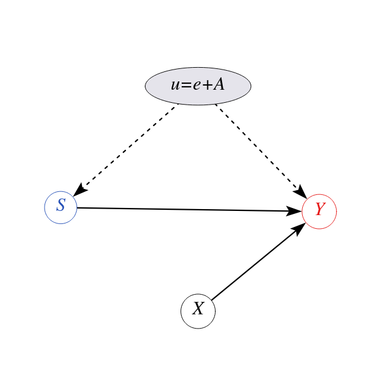

layout: true

<div class="my-footer"></div> 

---

```{r setup, include=FALSE,warning=FALSE,message=FALSE}
options(htmltools.dir.version = FALSE)
knitr::opts_chunk$set(
  message = FALSE,
  warning = FALSE,
  dev = "svg",
  cache = TRUE,
  fig.align = "center"
  #fig.width = 11,
  #fig.height = 5
)

# define vars
library(ggdag)
library(dplyr)
library(broom)
library(estimatr)
library(modelsummary)
library(ggplot2)
gm = modelsummary::gof_map
gm$omit <- TRUE
gm$omit[gm$clean == "R2 Adj."] <- FALSE
gm$omit[gm$clean == "Num.Obs."] <- FALSE
gom = "p.value.|se_type|statistic.end|statistic.overid|statistic.weakinst"

```

# Plano de Aula

* Motivando Variáveis Instrumentais
    * Retornos da Escolaridade
    * Mincer com Habilidade não Observada
* Mecânica das Variáveis Instrumentais
    * Identificação
    * Estimador de VI
* Estimação de VI via Mínimos Quadrados Ordinários em 2 Estágios
* Vamos implementar Angrist e Krueger (1991)!
* Instrumentos Fracos

---

# Retornos da Escolaridade

.pull-left[
* Qual é o impacto causal da escolaridade sobre os rendimentos?

* [Jacob Mincer](https://en.wikipedia.org/wiki/Jacob_Mincer) estava interessado nesta importante questão.

* Aqui está o modelo dele:

$$
\log Y_i = \alpha + \rho S_i + \beta_1 X_i + \beta_2 X_i^2 + e_i
$$
]

--
.pull-right[
* Comparamos os ganhos de pessoas com certa escolaridade e idade

* Tudo o mais é igual, depois de controlar isso?
     * Podemos encontrar trabalhadores com capacidades diferentes?
     
* Sim claro. Então, *todo o resto* não é igual.

* ***Viés de habilidade***
]


---

# Mincer com Habilidade não Observada

.pull-left[
* Na verdade temos *dois* fatores não-observáveis: $e$ e $A$.

* Não podemos distingui-los.

* $A_i$ tem efeito em ambos, $Y_i$ e $S_i$. ***Variável de confusão*** (confounder)

* Definimos um novo fator não observável
$$u_i = e_i + A_i$$

$$\log Y_i = \alpha + \rho S_i + \beta_1 X_i + \beta_2 X_i^2 + \underbrace{u_i}_{A_i + e_i}$$
]
--

.pull-right[

```{r mincer3,warning = FALSE,message = FALSE,echo = FALSE,fig.height = 6 }

```
]

---

layout: false
class: separator, middle

# Mecânica das Variáveis Instrumentais

## Identificação

---
layout: true

<div class="my-footer"></div> 

---

# Identificação

Vamos voltar ao nosso modelo linear simples:

$$
y = \beta_0 + \beta_1 x + u
$$

onde tememos que $Cov(x,u) \neq 0$, $x$ seja *endógeno*.

--
## Condições para VI

Seja $z$ nossa candidata a VI 
1. **Relevância do Instrumento**: $Cov(z,x) \neq 0$
1. **Exogenidade da VI** (restrição de exclusão): $Cov(z,u) = 0$, a VI é exógena na equação do resultado.


---

# Identificação

## Modelo Válido (A) vs Model Inválido (B) para VI `z`

```{r IV-dag2,warning = FALSE,message = FALSE,echo = FALSE,fig.height = 3.5 }
coords <- list(
    x = c(z = 1, x = 3, u = 4, y = 5),
    y = c(z = 0, x = 0, u = 0.5, y = 0)
    )

dag1 <- dagify(y ~ x + u,
              x ~ z + u, coords = coords)

d1 = dag1 %>% 
  tidy_dagitty() %>% 
  mutate(linetype = ifelse(name == "u", "dashed", "solid")) %>% 
  ggplot(aes(x = x, y = y, xend = xend, yend = yend)) + 
  geom_dag_point() + 
  geom_dag_text() + 
  geom_dag_edges(aes(edge_linetype = linetype), show.legend = FALSE) + 
  theme_void()

dag2 <- dagify(y ~ x + u,
              x ~ z + u, 
              z ~ u, coords = coords)

d2 = dag2 %>% 
  tidy_dagitty() %>% 
  mutate(linetype = ifelse(name == "u", "dashed", "solid")) %>% 
  ggplot(aes(x = x, y = y, xend = xend, yend = yend)) + 
  geom_dag_point() + 
  geom_dag_text() + 
  geom_dag_edges(aes(edge_linetype = linetype), show.legend = FALSE) + 
  theme_void()
cowplot::plot_grid(d1,NULL,d2,nrow = 1
  , rel_widths = c(1, 0.15, 1)
  , labels = c("(A)", "", "(B)"))
```

---

# Identificação

* Como estas condições ***identificam*** $\beta_1$?

--

\begin{align}
Cov(z,y) &= Cov(z, \beta_0 + \beta_1 x + u) \\
         &= \beta_1 Cov(z,x) + Cov(z,u) 
\end{align}

.pull-left[
Sob a condição 2. acima (**restrição de exclusão**), temos que $Cov(z,u)=0$, então:

$$
Cov(z,y) = \beta_1 Cov(z,x) 
$$
]

--

.pull-right[
e sob a condição 1. (**relevância**), temos $Cov(z,x)\neq 0$, portanto:

$$
\beta_1 =  \frac{Cov(z,y)}{Cov(z,x)}.
$$
]

--
* $\beta_1$ é ***identificado*** via os momentos populacionais $Cov(z,y)$ e $Cov(z,x)$ 

* Podemos ***estimar*** estes momentos através dos ***análogos amostrais*** (_sample plugin estimator_)


---

# Estimador de Variáveis Instrumentais

Basta "plugar" os momentos **amostrais**:

$$\hat{\beta}_1 = \frac{\sum_{i=1}^n (z_i - \bar{z})(y_i - \bar{y})}{\sum_{i=1}^n (z_i - \bar{z})(x_i - \bar{x})}$$

* A estimativa do intercepto é $\hat{\beta}_0 = \bar{y} - \hat{\beta}_1 \bar{x}$ 


---
# Como Saber se a VI é Válida?

## Condições para VI

1. **Relevância**: $Cov(z,x) \neq 0$
2. **Exclusão**: $Cov(z,u) = 0$

--
* Somente a condição **1.** pode ser testada empiricamente!

* `r emo::ji("warning")` Restrição de exclusão é hipótese não testável
    + Pesquisador deve se valer de teoria econômica e arguição lógica

---
layout: false
class: separator, middle

# Estimação de VI via Mínimos Quadrados Ordinários em 2 Estágios

---
layout: true

<div class="my-footer"></div> 

---
# Mínimos Quadrados Ordinários em 2 Estágios: MQ2E

**Equação estrutural**: $y_i=\beta_0+\beta_1 s_i + \beta_2 x_i + u_i$

--
1. Estimamos um **modelo de primeiro estágio** que usa apenas variáveis exógenas (como $z$) para explicar nosso regressor endógeno $s$.

2. Em seguida, usamos a **previsão** do 1º estágio, $\hat{s}$, no que é chamado de modelo de **segundo estágio**. Esse procedimento deve eliminar qualquer endogeneidade entre $\hat{s}$ e $y$.

\begin{align}
\text{1. Estágio: }s_i &= \alpha_0 + \alpha_1 z_i + \alpha_2 x_i + \eta_i \\
\text{2. Estágio: }y_i &= \beta_0 + \beta_1 \hat{s}_i + \beta_2 x_i + \varepsilon_i
\end{align}

--
**Condições:**

1. Relevância do IV: $\alpha_1 \neq 0$
1. Exogeneidade (restrição de exclusão): $E[u | z] = 0$

---
# Mínimos Quadrados Ordinários em 2 Estágios: MQ2E

O primeiro estágio isola a endogeneidade no termo de erro $\eta_i$

$$s_i=\underbrace{\alpha_0 + \alpha_1 z_i + \alpha_2 x_i}_{\hat{s}_i\text{: parte exógena}} + \eta_i$$
--
E utiliza somente a parte exógena no segundo estágio!

$$y_i = \beta_0 + \beta_1 \hat{s}_i + \beta_2 x_i + \varepsilon_i$$
Assim o segundo estágio faz uso somente de ***variações exógenas*** de $s_i$ e, portanto, $\hat{\beta}_1$ será não viesado.

--
* `r emo::ji("warning")` o primeiro estágio **DEVE** ser linear. Caso contrário, regressão proibida de Hausman! (MHE ch. 4, p. 142)

* Não realizamos manualmente porque os erros padrão no 2º estágio estarão errados

---
layout: false
class: separator, middle

# Vamos implementar Angrist e Krueger (1991)! 

---
layout: true

<div class="my-footer"></div> 

---

# Dados sobre aniversário e salários

Vamos carregar os dados e olhar seu sumário

```{r ak-data}
# remotes::install_github("jrnold/masteringmetrics", 
#                         subdir = "masteringmetrics")
data("ak91", package = "masteringmetrics")
# from the modelsummary package
datasummary_skim(data.frame(ak91), histogram = TRUE)
```

---

# Transformações dos Dados

* Queremos criar  uma _dummy_ `q4` que é `TRUE` se você nasceu no 4º trimestre.

* criar versões `factor` de trimestre e ano de nascimento.

```{r, cache=TRUE}
ak91 <- mutate(ak91,
               qob_fct = factor(qob),
               q4 = as.integer(qob == "4"),
               yob_fct = factor(yob))
# get mean wage by year/quarter
ak91_age <- ak91 %>%
  group_by(qob, yob) %>%
  summarise(lnw = mean(lnw), s = mean(s)) %>%
  mutate(q4 = (qob == 4))
```

---

# Primeiro Estágio!

.left-thin[
<br>
1. Os números rotulados significam trimestre de nascimento.

1. Nascidos no 4º trimestre **obtiveram** mais educação na maioria dos anos!

1. **Relevância da VI**.

]

.right-wide[
```{r ak91-dummy, eval = TRUE, echo = FALSE, fig.height = 5}
ggplot(ak91_age, aes(x = yob + (qob - 1) / 4, y = s )) +
  geom_line() + 
  geom_label(mapping = aes(label = qob, color = q4)) +
  guides(label = FALSE, color = FALSE) +
  scale_x_continuous("Year of birth", breaks = 1930:1940) +
  scale_y_continuous("Years of Education", breaks = seq(12.2, 13.2, by = 0.2),
                     limits = c(12.2, 13.2)) +
  theme_bw()
```
]

---

# Impacto da VI no resultado


.left-thin[
<br>
<br>
1. Nascidos no 4º trimestre estão entre os mais bem pagos por ano de nascimento.

1. Em geral, os salários semanais parecem diminuir um pouco ao longo do tempo.
]

.right-wide[

```{r ak91-wage,echo = FALSE,fig.height = 5}
ggplot(ak91_age, aes(x = yob + (qob - 1) / 4, y = lnw)) +
  geom_line() +
  geom_label(mapping = aes(label = qob, color = q4)) +
  scale_x_continuous("Year of birth", breaks = 1930:1940) +
  scale_y_continuous("Log weekly wages") +
  guides(label = FALSE, color = FALSE) +  
  theme_bw()
```
]

---

# Executando estimativa VI no `R`

<br>
<br>

.pull-left[
* Várias opções (como sempre com `R`! 😉)

* Usará a função [`iv_robust`](https://declaredesign.org/r/estimatr/reference/iv_robust.html) do pacote `estimatr`.

* *Robusto*? Calcula erros padrão corretos. [Detalhes aqui.](https://declaredesign.org/r/estimatr/articles/mathematical-notes.html)

* Observe o `predict` para obter $\hat{s}$.
]


.pull-right[
```{r, eval = TRUE}
library(estimatr)
# create a list of models
mod <- list()

# standard (biased!) OLS
mod$ols <- lm(lnw ~ s, data = ak91)

# IV: born in q4 is TRUE?
# doing IV manually in 2 stages.
mod$stage_1 <- lm(s ~ q4, data = ak91)
ak91$shat <- predict(mod$stage_1) #<<
mod$stage_2 <- lm(lnw ~ shat, data = ak91)

# run 2SLS
# doing IV all in one go
# notice the formula!
# formula = y ~ x | z
mod$MQ2E  <- iv_robust(lnw ~ s | q4,
                       data = ak91,
                       diagnostics = TRUE)
```
]

---
layout: false

# Resultados

.left-wide[
```{r ms1, echo = FALSE}
glance_custom.iv_robust <- function(x){
  f = x$diagnostic_first_stage_fstatistic
  if (is.null(f)) {
    return()
  } else {
    out <- tibble::tibble(`1. Stage F:` = f["value"])
    return(out)
  }
}
library(huxtable)
tab = msummary(models = mod,
               stars = TRUE,
               statistic = 'std.error',
               gof_omit = 'DF|Deviance|AIC|BIC|R2 Adj.|p.value|F$|se_type|statistic|Log.Lik.|Num.Obs.|N',
               output = "huxtable"
)
tab %>%
  set_bottom_border(row = 9, col = everywhere) %>%
  set_tb_padding(3.5)
```
]

.right-thin[
1. MQO viesado para baixo (erro de medição)

1. Primeira Fase: VI `q4` é estatisticamente significativo

1. O segundo estágio tem a mesma estimativa pontual que `MQ2E`, mas erro padrão diferente (segundo estágio está errado)
]

---
layout: true

<div class="my-footer"></div> 

---

# Lembra da estatística F?

* Encontramos isso antes: é útil testar modelos restritos versus irrestritos entre si.

--

* Aqui, estamos interessados em saber se nossos instrumentos são *conjuntamente* significativos. Claro, com apenas uma VI, isso não é mais informativo do que o t-stat dessa VI.

--

* A F-Stat compara o poder preditivo do primeiro estágio com e sem as VIs. Se eles tiverem poder preditivo muito semelhante, a F-stat será baixa e não poderemos rejeitar H0 de que nossas VIs são **conjuntamente insignificantes** no modelo do primeiro estágio. 

* **Instrumentos fracos**! 😞
---

# VI com um instrumento fraco

* VI é consistente sob determinadas premissas.

* No entanto, *mesmo* que tenhamos apenas $Cor(z,u)$ muito pequenos, podemos errar

* Pequena correlação entre $x$ e $z$ pode produzir estimativas **inconsistentes**.

$$
\text{plim}(\hat{\beta}_{1,IV}) = \beta_1 + \frac{Cor(z,u)}{Cor(z,x)} \cdot \frac{\sigma_u}{\sigma_x}
$$

--


* Um **instrumento fraco** é aquele com pequeno valor absoluto para $Cor(z,x)$

* Usamos o teste F no primeiro estágio para verificar a existência de instrumentos fracos. Regra de bolso: $F_{stat} > 10$ (Staiger e Stock, 1997) contestada por Lee et al. 2021.


---

# Leitura Recomendada

* WOOLDRIDGE, Jeffrey M. Introdução à econometria: uma abordagem moderna. São Paulo: Cengage Learning, 2016. Tradução da 4ª edição norte-americana por José Antonio Ferreira. Capítulo 15 Estimação de Variáveis Instrumentais e Mínimos Quadrados em dois Estágios.

* GUJARATI, Damodar N.; PORTER, Dawn C. Econometria básica. Porto Alegre: Amgh Editora, 2011. - 5. ed.

* ANGRIST, Joshua D.; PISCHKE, Jörn-Steffen. Mostly harmless econometrics: An empiricist's companion. Princeton university press, 2009. Chapter 4 Instrumental Variables in Action.

* STAIGER, Douglas; James H. Stock. Instrumental Variables Regression with Weak Instruments. Econometrica, vol. 65, no. 3, 1997, pp. 557–86. JSTOR, https://doi.org/10.2307/2171753.

* LEE, David S. et al. Valid t-ratio Inference for IV. National Bureau of Economic Research, 2021.
---

layout: false

class: title-slide-final, middle
background-image: url(../../img/logo/UdescEsag.jpeg)
background-size: 350px
background-position: 9% 19%

# ATÉ A PRÓXIMA AULA!

Com a Lista 2 feita! `r emo::ji("white_check_mark")`

.footnote[
[1]: Este slides foram baseados nas aulas de econometria da [SciencesPo Department of Economics](https://github.com/ScPoEcon/ScPoEconometrics-Slides)
]


|                                                                                                            |                                   |
| :--------------------------------------------------------------------------------------------------------- | :-------------------------------- |
| <a href="https://github.com/rfbressan/econometria3_slides">.ScPored[<i class="fa fa-link fa-fw"></i>] | Slides |
| <a href="http://github.com/rfbressan">.ScPored[<i class="fa fa-github fa-fw"></i>]                          | @rfbressan                      |
| <a href="https://raw.githack.com/rfbressan/econometria3_slides/master/lectures/05-IV2/lista_I_pt.html">.ScPored[<i class="fa fa-list fa-fw"></i>] | Lista de Exercícios I |
