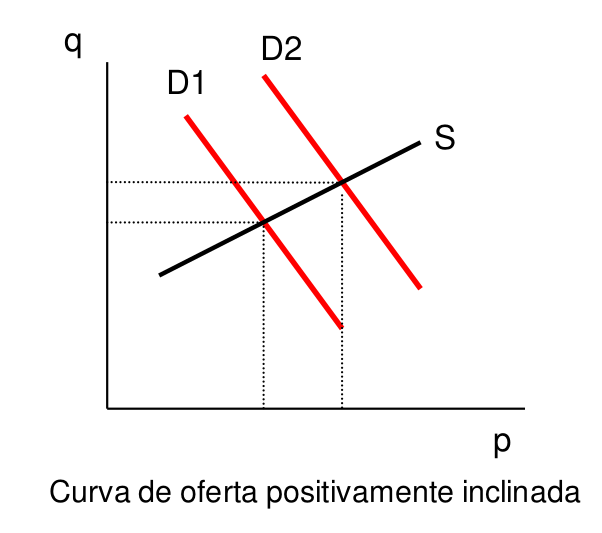

layout: true

<div class="my-footer"></div> 

---

```{r setup, include=FALSE,warning=FALSE,message=FALSE}
options(htmltools.dir.version = FALSE)
knitr::opts_chunk$set(
  message = FALSE,
  warning = FALSE,
  dev = "svg",
  cache = TRUE,
  fig.align = "center"
  #fig.width = 11,
  #fig.height = 5
)

# define vars
om = par("mar")
lowtop = c(om[1],om[2],0.1,om[4])

overwrite = FALSE

library(tidyverse)
library(ggplot2)
library(emo)
library(dplyr)
library(econocharts)
library(fixest)
library(xaringanExtra)
# library(png)
# library(grid)
# library(pander)
```

layout: true

<div class="my-footer"></div> 

---

# Introdução

- Até agora nos preocupamos apenas com modelos de regressão com **uma única equação** 

- Modelos em que há uma **única variável dependente** e uma ou mais variáveis
explicativas

- Nesses modelos, o foco foi a estimação do valor médio da variável resposta (dependente), condicionado aos valores das variáveis explicativas (regressores).

- A relação de causa e efeito, nesses modelos, se existir, vai das variáveis explicativas para a variável resposta

---

# Introdução

- Porém, existem casos onde essa relação unidirecional não faz sentido econômico

- Isso ocorre quando a variável resposta é determinada por um grupo de variáveis explicativas onde algumas são, por sua vez, determinadas pela variável resposta.

--

- Temos ***determinação simultânea*** de variáveis econômicas 

- Também pode ser entendida como ***causalidade reversa***

---

# Introdução

- Há uma relação simultânea, entre a variável resposta e alguns regressores endógenos, o que torna a distinção entre variáveis dependentes e independentes duvidosa.

- Agrupamos o conjunto de variáveis que possam ser determinadas simultaneamente exatamente como se faz em modelos de equações.

--

- Assim, nos ***modelos de equações simultâneas*** há mais de uma equação – uma para cada variável endógena.

---

# Exemplo
## Oferta e Demanda

- O preço **P** de um bem e a quantidade **Q** vendida são determinados pela intersecção das curvas de demanda e oferta desse bem.

- Para simplificar, vamos supor que as curvas de oferta e demanda sejam lineares e, ainda, acrescentando os choques aleatórios, $u_1$ e $u_2$ , podemos escrever as equações de oferta e demanda empíricas como:

--

$$
\begin{align*}
Q^d&=\alpha_1+\alpha_2 P + u_1, &\alpha_2<0\\
Q^o&=\beta_1+\beta_2 P + u_2, &\beta_2>0\\
Q^d&=Q^o=Q
\end{align*}
$$

---

# Exemplo
## Oferta e Demanda

.pull-left[
```{r oferta-demanda, echo=FALSE, out.width=420}

```
]

.pull-right[
- Se a ***curva de oferta*** tiver inclinação positiva e houver um ***choque de demanda*** $u_1$, a curva da demanda se deslocará 

- Entretanto, como mostra a figura ao lado, um deslocamento na demanda altera tanto a quantidade **Q** quanto o preço **P**

- Ou seja, $u_1$ e P não podem ser considerados independentes.
]

---

# Exemplo
## Oferta e Demanda

$\underbrace{\alpha_1+\alpha_2 P + u_1}_{Q^d} = \underbrace{\beta_1+\beta_2 P + u_2}_{Q^o}$ - Condição de equilíbrio

$$P=\underbrace{\frac{\alpha_1-\beta_1}{\beta_2-\alpha_2}}_{\pi_1}+\underbrace{\frac{u_1-u_2}{\beta_2-\alpha_2}}_{v_1}$$

--

- Fica claro que **P** contém o termo de erro $u_1$ (e $u_2$!), logo não pode ser exógeno em nenhuma das duas equações

- O mesmo procedimento pode ser feito para **Q**

---

# Viés de Simultaneidade

- ***Simultaneidade*** ocorre quando uma ou mais variáveis explicativas são determinadas conjuntamente com a variável dependente

- Quando há simultaneidade, o método **MQO gera estimadores viesados** e inconsistentes.

- Regressores não são exógenos! $E[u\mid X]\neq 0$

---
# Viés de Simultaneidade no MQO

$$
\begin{align*}
y_1&=\alpha_1y_2+\beta_1z_1+u_1\\
y_2&=\alpha_2y_1+\beta_2z_2+u_2
\end{align*}
$$

- Vamos nos concentrar em estimar a primeira equação.

- Para dar interpretação causal e estimar por MQO, $y_2$ deve ser *não correlacionada* com $u_1$

--

$$(1-\alpha_1\alpha_2)y_2=\alpha_2\beta_1z_1+\beta_2z_2+\alpha_2u_1+u_2,\qquad \text{ hipótese: }\alpha_1\alpha_2\neq 1$$
--

- $y_2=\pi_{21}z_1+\pi_{22}z_2+v_2$

- $v_2=(\alpha_2u_1+u_2)/((1-\alpha_1\alpha_2))$

--

- Ou seja, $y_2$ contém em seu termo de erro $v_2$ o erro $u_1$!!
  + Exceção: $\alpha_2=0$ quando $u_1\perp u_2$. Equações desacopladas

---
# Viés de Simultaneidade no MQO

- Quando $y_2$ for correlacionado com $u_1$ em virtude das equações simultâneas, dizemos que **MQO sofre de viés de simultaneidade**

- A direção do viés pode ser complicada em modelos mais complexos

- Partimos da covariância de $y_2$ com $u_1$

--

$Cov(y_2, u_1)=Cov(v_2, u_1)$ Por quê?

--

$Cov(y_2, u_1)=\frac{\alpha_2}{(1-\alpha_1\alpha_2)}\sigma_1^2$


---

# Problema de Identificação

Por ***problema de identificação*** entendemos a possibilidade de recuperar os parâmetros de uma **equação estrutural** a partir dos coeficientes estimados na **forma reduzida**.

--

- ***Equação estrutural*** é aquela que retrata a estrutura de uma economia ou o
comportamento de um agente econômico. Exemplos: curva de oferta e demanda

- ***Forma reduzida*** é a equação que expressa uma variável endógena apenas em termos das variáveis exógenas e dos termos de erros estocásticos.
  + Exemplo anterior: $y_2=\pi_{21}z_1+\pi_{22}z_2+v_2$

--

- A equação estrutural é ***identificada*** quando a recuperação de todos os seus parâmetros puder ser feita com base nos parâmetros estimados da forma reduzida.

---

# Problema de Identificação

- O problema de identificação surge pois uma equação na forma reduzida pode ser **compatível com diferentes equações estruturais** ou diferentes hipóteses (modelos)

- Dessa forma, não é possível dizer qual modelo específico está sob investigação.

- Maneira fácil de saber: forma reduzida possui menos parâmetros que as equações estruturais

---

# Exemplo de (Não) Identificação

Voltamos ao nosso exemplo. As formas reduzidas são:

$$
\begin{align*}
P&=\pi_1+v_1\\
Q&=\pi_2+v_2,
\end{align*}
$$
onde

$\pi_1=\frac{\alpha_1-\beta_1}{\beta_2-\alpha_2}$, $v_1=\frac{u_1-u_2}{\beta_2-\alpha_2}$, $\pi_2=\frac{\alpha_1\beta_2-\alpha_2\beta_1}{\beta_2-\alpha_2}$ e $v_2=\frac{\beta_2 u_1 - \alpha_2 u_2}{\beta_2-\alpha_2}$

--

- A forma reduzida provê apenas 2 parâmetros, $\pi_1$ e $\pi_2$

- Nossas equações estruturais possuem 4 parâmetros, $\alpha_1, \alpha_2, \beta_1, \beta_2$.

--

- Portanto, **não é possível** calcular os parâmetros estruturais a partir dos coeficientes estimados na forma reduzida

---

# Condição de Classificação

A primeira equação em um modelo de equações simultâneas com duas equações será identificada se, e somente se, a segunda equação contiver **ao menos uma variável exógena** (com coeficiente diferente de zero) que esteja *excluída* da primeira equação.

--

$$
\begin{align*}
Q^d&=\alpha_1+\alpha_2 P + u_1, &\alpha_2<0\\
Q^o&=\beta_1+\beta_2 P + u_2, &\beta_2>0\\
Q^d&=Q^o=Q
\end{align*}
$$

- Não temos **nenhuma variável exógena** neste modelo! A condição de classificação não é satisfeita

- Equações estruturais não identificadas (ou subidentificadas)

---

# Condição de Classificação

- Alteramos o modelo incluindo a renda **Y** e assumindo que esta seja exógena

$$
\begin{align*}
Q^d&=\alpha_1+\alpha_2 P + \gamma_1 Y + u_1, &\alpha_2<0\\
Q^o&=\beta_1+\beta_2 P + u_2, &\beta_2>0\\
Q^d&=Q^o=Q
\end{align*}
$$

- Qual das equações estruturais passa a ser identificada?

--

- É a equação de **oferta**! Uma equação é identificada se a outra equação do modelo possuir uma variável exógena

- Renda exógena funciona como uma variável de deslocamento (_shifter_) da demanda

- Variações exógenas de demanda permitem identificar a curva de oferta

---

# Condição de Classificação

```{r oferta-id, echo=FALSE, out.width=480, results='hide'}
# Custom data
q <- 1:20
ps <- 1 + 0.8*q
pd <- 10 - 1.2*q
# df <- data.frame(x = q, ys = ps, yd = pd)
supply1 <- data.frame(x = q, y = ps)

demand1 <- data.frame(x = q, y = pd)
demand2 <- data.frame(x = q, y = 15 - 1.2*q)
demand3 <- data.frame(x = q, y = 20 - 1.2*q)
demand4 <- data.frame(x = q, y = 25 - 1.2*q)

p <- sdcurve(supply1,   # Custom data
             demand1,
             supply1,
             demand2,
             supply1,
             demand3,
             supply1,
             demand4,
             equilibrium = TRUE, # Calculate the equilibrium
             bg.col = "white") # Background color

p + annotate("segment", x = 2.5, xend = 5, 
             y = 7.5, yend = 7.5,                # Add more layers
             arrow = arrow(length = unit(0.3, "lines")), 
             colour = "grey50") +
    annotate("segment", x = 5, xend = 7.5, 
             y = 9.5, yend = 9.5,                # Add more layers
             arrow = arrow(length = unit(0.3, "lines")), 
             colour = "grey50") +
    annotate("segment", x = 7.5, xend = 10, 
             y = 11.5, yend = 11.5,                # Add more layers
             arrow = arrow(length = unit(0.3, "lines")), 
             colour = "grey50")
    
```

---

# Exemplo

## Taxas de Assassinatos e Força Policial

- Esperamos que o tamanho da força policial em um determinado município, ***reduza*** a criminalidade. Um simples modelo pode ser

$$assaspc=\alpha_1 polpc+\beta_{10}+\beta_{11}rendapc+u_1$$
- A **pergunta de pesquisa** é: qual o efeito do aumento da força policial no número de assassinatos per capita?

- Vejam que a pergunta é **causal** e portanto, necessitamos de exogeneidade na variação do policiamento

--

.center[**Este é o caso** `r emo::ji("question")`]

---

# Exemplo

## Taxas de Assassinatos e Força Policial

- É fácil imaginar que não, não é o caso do policiamento ser exógeno em relação ao número de assassinatos em um município

- O tamanho da **força policial responde** ao índice de criminalidade!

$$polpc=\alpha_2 assaspc+\beta_{20}+u_2$$

--

- Qual o sinal esperado de $\alpha_1$ e $\alpha_2$?
- É possível interpretar diretamente a primeira equação de forma causal?
- Qual(is) das equações estruturais são identificadas

---

# Exemplo

- E se a renda também estiver incluída na força policial ?

$$\begin{align*}
assaspc&=\alpha_1 polpc+\beta_{10}+\beta_{11}rendapc+u_1\\
polpc&=\alpha_2 assaspc+\beta_{20}+\beta_{21}rendapc+u_2
\end{align*}$$

--

- Ainda teremos **identificação** de alguma das equações estruturais `r emo::ji("question")`

--

- .red[Não] mais! Apesar da renda ser exógena nas duas equações estruturais, ela não atende a **restrição de exclusão**

---

# Exemplo

```{r oferta-id1, echo=FALSE, out.width=480, results='hide'}
supply2 <- data.frame(x = q, y = 3 + 0.8*q)

p <- sdcurve(supply1,   # Custom data
             demand1,
             supply2,
             demand2,
             equilibrium = TRUE, # Calculate the equilibrium
             bg.col = "white") # Background color

p + annotate("segment", x = 2.5, xend = 5, 
             y = 7.5, yend = 7.5,                # Add more layers
             arrow = arrow(length = unit(0.3, "lines")), 
             colour = "grey50") +
    annotate("segment", x = 7.5, xend = 7.5, 
             y = 7.5, yend = 8.4,                # Add more layers
             arrow = arrow(length = unit(0.3, "lines")), 
             colour = "grey50")

```

---

# Estimação de Modelos de Equações Simultâneas

- Uma vez que temos um sistema (ou pelo menos uma das equações) identificável, ***como estimar seus parâmetros***?

--

- Já sabemos como fazê-lo

.center[**Através de Mínimos Quadrados em 2 Estágios**]

--

- Variáveis exógenas servirão como **instrumentos** para as variáveis endógenas

---

# Exemplo MQ2E

## Oferta de Trabalho de Mulheres Casadas que Trabalham

$$
\begin{align*}
hours&=\alpha_1 lwage + \beta_{10}+ \beta_{11}educ+\beta_{12}age+\beta_{13}kidslt6+\beta_{14}nwifeinc+u_1\\
lwage&=\alpha_2 hours + \beta_{20}+ \beta_{21}educ+ \beta_{22}exper+\beta_{23}exper^2+ u_2 
\end{align*}
$$

- **Hipóteses:** apenas `hours` e `lwage` são endógenas
  + `educ` poderia ser endógena. Ignore para efeitos de ilustração
  
--

- Condição de classificação é satisfeita se $\beta_{22}\neq 0$ ou $\beta_{23}\neq 0$

- Testamos através da forma reduzida da segunda equação

---

# Exemplo MQ2E

## Oferta de Trabalho de Mulheres Casadas que Trabalham

```{r panels, echo=FALSE}
xaringanExtra::use_panelset()
```

.panelset[
.panel[.panel-name[Código]
```{r exemplo-mq2e, echo=TRUE}
library(wooldridge)
data("mroz")

reg_1st <- feols(lwage~educ+age+kidslt6+nwifeinc+exper+expersq,
                 data = mroz, vcov = "HC1")
```
]

.panel[.panel-name[Resultados]
```{r , results='asis', echo=FALSE}
modelsummary::msummary(reg_1st,
                       fmt = 4,
                       estimate = "{estimate} ({std.error})",
                       statistic = NULL,
                       gof_map = c("nobs"))
```
]
]
---

# Exemplo MQ2E

## Oferta de Trabalho de Mulheres Casadas que Trabalham

.panelset[
.panel[.panel-name[Código]
```{r exemplo-mq2e2, echo=TRUE}
# Regressão MQO viesada
reg_mqo <- feols(hours~lwage+educ+age+kidslt6+nwifeinc, 
                 data = mroz, vcov = "HC1")
# Regressão VI sobreidentificada
reg_vi <- feols(hours~educ+age+kidslt6+nwifeinc | lwage ~ exper+expersq, 
                 data = mroz, vcov = "HC1")
```
]

.panel[.panel-name[Resultados]
```{r exemplo-mq2e-tbl, echo=FALSE, results='markup'}
modelsummary::msummary(list(MQO = reg_mqo, VI = reg_vi),
                       fmt = 2,
                       estimate = "{estimate} ({std.error})",
                       statistic = NULL,
                       coef_rename = c("fit_lwage" = "lwage"),
                       gof_map = c("nobs"))
# etable(reg_mqo, reg_vi)
```
]
]
---

# Sistemas com mais de 2 Equações

$$
\begin{align*}
y_1&=\alpha_{12}y_2+\alpha_{13}y_3+\beta_{11}z_1+u_1\\
y_2&=\alpha_{21}y_1+\beta_{21}z_1+\beta_{22}z_2+\beta_{23}z_3+u_2\\
y_3&=\alpha_{32}y_2+\beta_{31}z_1+\beta_{32}z_2+\beta_{33}z_3+\beta_{34}z_4+u_3
\end{align*}
$$

- Geralmente complicado *mostrar que é identificada*

- Fácil verificar equações que **não são identificadas**

- Qual destas equações claramente não é identificada `r emo::ji("question")`

--

- Na terceira equação .red[não existe VI possível] para $y_2$

--

- As outras duas equações possuem VI potenciais (exógenas excluídas da eq. estrutural)

---

# Condição de Ordem Geral

*Em um modelo de M equações simultâneas, para que uma equação seja identificada, o número de variáveis exógenas (ou predeterminadas) excluídas da equação não deve ser menor que o número de variáveis endógenas incluídas nessa equação menos 1*

- M – número de variáveis endógenas no modelo
- m – número de variáveis endógenas em uma dada equação
- K – número de variáveis exógenas no modelo
- k – número de variáveis exógenas em uma dada equação

$K – k \geq m – 1$

--

- **Observações:**
  + A variável dependente faz parte da contagem de endógenas
  + Na igualdade dizemos que a equação é exatamente identificada
  + A condição de ordem é necessária para a identificação mas não é suficiente. 

---

# Exemplo

$$
\begin{align*}
y_1&=\alpha_{12}y_2+\alpha_{13}y_3+\beta_{11}z_1+u_1\\
y_2&=\alpha_{21}y_1+\beta_{21}z_1+\beta_{22}z_2+\beta_{23}z_3+u_2\\
y_3&=\alpha_{32}y_2+\beta_{31}z_1+\beta_{32}z_2+\beta_{33}z_3+\beta_{34}z_4+u_3
\end{align*}
$$

- Suponha que todos os $\beta$ sejam diferentes de zero

- $M=3$, $K=4$

--

- Eq. 1: $m=3$, $k=1$. Logo, $4-1>3-1$. Condição de ordem é atendida com desigualdade estrita. **Equação é sobreidentificada**

- Eq. 2 `r emo::ji("question")`

---

# Equações Simultâneas com Séries Temporais

- Uma das aplicações mais antigas de SEM, grandes modelos macroeconômicos

- Modelo Keynesiano de demanda agregada (economia fechada)

$$
\begin{align*}
C_t&=\beta_0+\beta_1(Y_t-T_t)+\beta_2 r_t+\beta_3 C_{t-1}+u_{1t}\\
I_t&=\gamma_0+\gamma_1r_t+\gamma_2 Y_{t-1}+u_{2t}\\
Y_t&\equiv C_t+I_t+G_t
\end{align*}
$$

--

- $C_t, I_t, Y_t$ são endógenas

- Variáveis defasadas são chamadas de ***variáveis predeterminadas***

--

- Variáveis predeterminadas *podem ser consideradas exógenas* sob a condição de **exogeneidade estrita** dos erros. $u_t\perp X_t$ e $u_t \perp Y_{t-i}, X_{t-i}, i=1,\ldots, T$ 

---

# Equações Simultâneas com Séries Temporais

- Como poderíamos estimar as equações deste modelo?

$$
\begin{align*}
C_t&=\beta_0+\beta_1(Y_t-T_t)+\beta_2 r_t+\beta_3 C_{t-1}+u_{1t}\\
I_t&=\gamma_0+\gamma_1r_t+\gamma_2 Y_{t-1}+u_{2t}\\
Y_t&\equiv C_t+I_t+G_t
\end{align*}
$$

--

- A equação do **investimento** $I_t$ possui apenas variáveis exógenas ou predeterminadas. Assumindo exogeneidade estrita, é possível estimar via MQO

--

- A equação do **consumo** $C_t$ necessita instrumentalização da renda $Y_t$. MQ2E onde os **instrumentos** serão as variáveis exógenas e predeterminadas **excluídas** da equação

---

# Exemplo
## Hipótese da Renda Permanete

- Vamos usar VI para testar a Hipótese da Renda Permanente (HRP)

$$cc_t=\beta_0+\beta_1 cy_t + \beta_2 r3_t + u_t$$

- $cc_t=\Delta\log(c_t)$ é o crescimento anual do consumo per capita real. $y_t$ denota a renda disponível e $r3_t$ a taxa de juros real

--

- HRP pura implica em $\beta_1=\beta_2=0$. Caso contrário alguma parte da população estaria consumindo renda corrente

--

- Muito embora o valor esperado do erro, condicional a todo o conjunto de informação até o período anterior seja zero, $E[u_t\mid \Omega_{t-1}]$

- **Consumo, Renda e Juros** ainda podem ser entendidos como ***simultaneamente determinados***

---

# Exemplo
## Hipótese da Renda Permanete

- Como $u_t$ não é correlacionado com $cc_{t-1}, cy_{t-1}$ e $r3_{t-1}$, estas são candidatas a variável instrumental

--

.panelset[
.panel[.panel-name[Código]
```{r hrp-model, echo=TRUE}
library(wooldridge)
data("consump")

reg <- feols(gc~1 | gy+r3 ~ gc_1+gy_1+r3_1,
             data = consump, vcov = "HC1")
```
]

.panel[.panel-name[Resultados]
```{r , results='asis', echo=FALSE}
modelsummary::msummary(reg,
                       fmt = 5,
                       estimate = "{estimate} ({std.error})",
                       statistic = NULL,
                       coef_rename = c("(Intercept)" = "Intercepto",
                                       "fit_gy" = "gy",
                                       "fit_r3" = "r3"),
                       gof_map = c("nobs"))
```

- Neste caso **rejeitamos a HRP pura**
]
]


---

# Leitura Recomendada

* WOOLDRIDGE, Jeffrey M. Introdução à econometria: uma abordagem moderna. São Paulo: Cengage Learning, 2016. Tradução da 4ª edição norte-americana por José Antonio Ferreira. 

* HANSEN, Bruce E. Econometrics. Manuscript, revision of February 2020.

* ANGRIST, Joshua D.; PISCHKE, Jörn-Steffen. Mostly harmless econometrics: An empiricist's companion. Princeton university press, 2009.

---
layout: false

class: title-slide-final, middle
background-image: url(../../img/logo/UdescEsag.jpeg)
background-size: 350px
background-position: 9% 19%

# ATÉ A PRÓXIMA AULA!


|                                                                                                            |                                   |
| :--------------------------------------------------------------------------------------------------------- | :-------------------------------- |
| <a href="https://github.com/rfbressan/econometria3_slides">.ScPored[<i class="fa fa-link fa-fw"></i>] | Slides |
| <a href="http://github.com/rfbressan">.ScPored[<i class="fa fa-github fa-fw"></i>]                          | @rfbressan                      |


