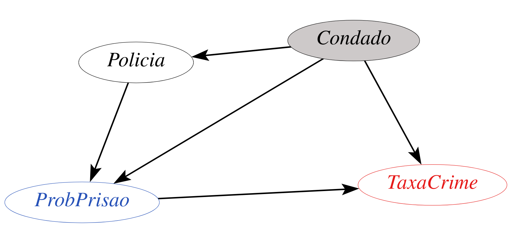

layout: true

<div class="my-footer"></div> 

---

```{r setup, include=FALSE,warning=FALSE,message=FALSE}
options(htmltools.dir.version = FALSE)
knitr::opts_chunk$set(
  message = FALSE,
  warning = FALSE,
  dev = "svg",
  cache = TRUE,
  fig.align = "center"
  #fig.width = 11,
  #fig.height = 5
)

# define vars
om = par("mar")
lowtop = c(om[1],om[2],0.1,om[4])
library(magrittr)

library(data.table)
gofmap = data.table(modelsummary::gof_map)
gofmap[, omit := TRUE]
gofmap[clean == "R2", omit := FALSE]

```


exclude: true

```{r the-toc, include=FALSE}
infile <- knitr::current_input()
outfile <- "the-TOC.Rmd"
outline_heading <- "# Outline"
update_TOC <- TRUE
source("../child_TOC.R")
```

---

class: inverse
name: the-toc

```{r child = "the-TOC.Rmd"}
```

---

# Dados de Cortes Transversais

.pull-left[
Até agora, lidamos com dados que se parecem com isso:

```{r,message=FALSE,warning=FALSE,echo = FALSE}
library(dplyr)
library(ggplot2)
data(crime4, package = "wooldridge")
crime4 %>%
   filter(year == 81) %>%
   arrange(county, year) %>%
   select(county, crmrte, prbarr) %>%
   rename(Condado = county,
          CrimeRate = crmrte,
          ProbofArrest = prbarr) %>%
   slice(1:5) %>%
   knitr::kable(align = "ccc")
```
]

.pull-right[

* Temos um identificador de unidade (como `Condado` aqui)

* Variáveis observáveis em cada unidade

* Geralmente chamado de conjunto de dados de **seção transversal** (_cross-section_)

* Fornece visualização de um momento instantâneo

* Cada linha é uma *observação*, cada coluna uma *variável*
]

---

# Dados em Painel

.pull-left[
Agora, vamos adicionar um índice de `tempo`: `Ano`.

```{r,echo = FALSE}
crime4 %>%
  select(county, year, crmrte, prbarr) %>%
  arrange(county,year) %>%
  rename(Condado = county,
         Ano = year,
         CrimeRate = crmrte,
         ProbofArrest = prbarr) %>%
  slice(1:9) %>%
  knitr::kable(align = "ccc")
```
]

.pull-right[

* Ao lado do identificador da unidade (`Condado`) temos agora `Ano`

* Agora um par (`Condado`, `Ano`) indexa uma observação.

* Chamamos isso de conjunto de dados em **painel** ou **longitudinal**

* Podemos rastrear unidades *ao longo do tempo*.

* **Seções transversais repetidas** quando não são os mesmos indíviduos

]
---

# Taxas de Criminalidade e Probabilidade de Prisão

* Os dados acima podem ser carregados com
    ```{r, eval = FALSE}
    data(crime4,package = "wooldridge")
    ```

* Eles são de [C. Cornwell e W. Trumball (1994), “Estimating the Economic Model of Crime with Panel Data”](https://www.amherst.edu/media/view/121570/original/CornwellTrumbullCrime%2BElasticities.pdf).

--

* Uma pergunta aqui: *qual é o tamanho do efeito dissuasor da aplicação da lei*? Se você sabe que é mais provável que seja preso, será menos provável que cometa um crime?

--

* Isso é complicado: a criminalidade alta *causa* uma resposta policial mais forte, que atua como um impedimento, ou o crime é baixo porque o impedimento é forte para começar?

* Isso às vezes é chamado de uma situação de *modelo de equação simultânea*: a resposta da polícia afeta o crime, mas o crime afeta a resposta da polícia

\begin{align}
police &= \alpha_0 + \alpha_1 crime \\
crime &= \beta_0 + \beta_1 police
\end{align}

---

# Taxas de Criminalidade e Probabilidade de Prisão

.pull-left[

* A maioria da literatura anterior a esse artigo estimava equações simultâneas de dados de corte transversal

* Cornwell e Trumball estão preocupados com a **heterogeneidade não observada** entre as jurisdições.

* Por quê? O que poderia dar errado?

]

.pull-right[

* Vamos escolher 4 condados do nosso conjunto de dados

* Vejamos a relação entre taxa de criminalidade vs probabilidade de prisão

* Primeiro para todos eles juntos como uma única seção transversal

* Em seguida, aproveitando a estrutura do painel (ou seja, cada condado ao longo do tempo).

]


---

# Crime vs Prisão em Seção Transversal

.left-thin[

1. Subconjunto de dados para 4 condados

1. plotar taxa de criminalidade versus probabilidade de prisão.

```{r crime1, echo = TRUE, eval = FALSE, include=FALSE}
css = crime4 %>% 
  filter(county %in% 
           c(1,3,145, 23))  

ggplot(css,
       aes(x = prbarr, 
           y = crmrte)) + 
  geom_point() + 
  geom_smooth(method="lm",
              se=FALSE) + 
  theme_bw() +
  labs(x = 'Probabilidade de prisão', 
       y = 'Taxa de criminalidade')
```
]

.right-wide[
```{r,echo = FALSE,fig.height=5}
css = crime4 %>% 
  filter(county %in% c(1,3,145, 23))  # subset to 4 counties

ggplot(css,aes(x =  prbarr, y = crmrte)) + 
  geom_point() + 
  geom_smooth(method="lm",se=FALSE) + 
  theme_bw() +
  labs(x = 'Probabilidade de prisão', y = 'Taxa de criminalidade')
```
]

---

# Crime vs Prisão em Seção Transversal

## relacionamento positivo!

.pull-left[

* Vemos uma linha inclinada para cima!

* Maior probabilidade de prisão está associada a maiores taxas de criminalidade.

* Quão forte é o efeito?

```{r}
xsection = lm(crmrte ~ prbarr, css)
coef(xsection)[2]  # gets slope coef
```

]

--

.pull-right[

```{r,echo = FALSE}
xsection_p = round(predict(xsection,
                           newdata = data.frame(prbarr = c(0.2,0.3))),3)
```


* Aumentar a probabilidade de prisão em 0.1 unidade (ou seja, 10 pontos percentuais), aumenta a taxa de criminalidade em `r format(coef(xsection)[2]/10, digits = 4)`. 

* Aumento de 10 p.p. na probabilidade de prisão (por exemplo, `prbarr` passa de 0,2 para 0,3) ...

* ... está associado a um aumento na taxa de criminalidade de `r xsection_p[1]` para `r xsection_p[2]`, ou um `r round(100 * diff(xsection_p) / xsection_p[1],2)` percentual de aumento na taxa de criminalidade.

]

---

# Crime vs Prisão em Seção Transversal

## Ok, mas o que isso *significa*?


* Literalmente: condados onde existe maior probabilidade de ser preso também têm maior índice de criminalidade.

* Então, isso significa que polícia mais eficiente em prender criminosos e, portanto, a probabilidade de ser preso é mais alta, causa aumento de criminalidade?

--

* Do que depende a eficiência da polícia?

* O nível de pobreza em um condado importa para isso?

* As leis locais?

* 🤯 Uau, parece haver muitas coisas deixadas de fora desta imagem simples. 


---

# Variação Intragrupo e Entre-grupos 

Você ouvirá frequentemente os termos variação *intra* (_within_) e *entre* (_between_) em contextos de dados de painel.

.pull-left[

## Variação Intra

* coisas que mudam *dentro de cada grupo* ao longo do tempo:

* aqui dissemos orçamentos policiais

* e os níveis de pobreza mudariam dentro de cada grupo e ao longo do tempo.

]

.pull-right[

## Variação Entre

* Coisas que são **fixas** para cada grupo ao longo do tempo:

* Leis e costumes locais

* Direitos Civis

* diferem apenas **entre** grupos

]
---

# Variação Intragrupo e Entre-grupos

.left-wide[
```{r,echo = FALSE,message = FALSE, fig.height = 5, fig.align='center'}
pcolor = css %>% 
  group_by(county) %>%
  mutate(label = case_when(
    crmrte == max(crmrte) ~ paste('County',county),
    TRUE ~ NA_character_
  ),
  mcrm = mean(crmrte),
  mpr = mean(prbarr)) %>%
  ggplot(aes(x =  prbarr, y = crmrte, label = label)) + 
  geom_point(aes(color = factor(county))) + 
  theme_bw() +
  geom_smooth(method = "lm", se=FALSE) +
  labs(x = 'Probabilidade de prisão', 
       y = 'Taxa de criminalidade',
       color = "Condado") 
pcolor
```
]

---

# Apresentando o *Efeito Fixo*

.left-wide[
```{r cri-dag2,echo = FALSE,message = FALSE,fig.height = 5}

```
]

.right-thin[

* Coletamos todos as características invariáveis no tempo e específicas do grupo no fator `Condado`.

* Controla todos os fatores que *não* variam ao longo do tempo dentro de cada unidade.

* Chamamos `Condado` de **efeito fixo**.
]


---
layout: false
class: separator, middle

# Estimação de Efeitos Fixos


---
layout: true

<div class="my-footer"></div> 

---

# Variável Omitida, VI e Dados em Painel

Vimos *viés de variável omitida* (OVB). Por exemplo, se o modelo verdadeiro for:

$$
y_i = \beta_0 + \beta_1 x_i + c_i + u_i
$$
se $c_i$ é não observável e $Cov(x_i, c_i)\neq0 \Rightarrow E[v_i|x_i]\neq 0$ com $v_i = u_i + c_i$ erro composto
--

.pull-left[

## Solução Seção Transversal

* onde $c_i$ é variável omitida. **Viés**! `r emo::ji("sob")` 

* Encontre IV correlacionado com probabilidade de prisão, mas não condado
]

--

.pull-right[

## Solução Dados em Painel

$$y_{it} = \beta_1 x_{it} + c_i + u_{it},\quad t=1,2,...T$$
* $c_i$: *efeito fixo individual* ou *heterogeneidade não observada*.

* $c_i$: é fixo ao longo do tempo (eg. costumes locais), mas pode ser correlacionado com $x_{it}$!
]


---

# Regressão com Variável _Dummy_


* Abordagem mais simples: inclua uma variável _dummy_ para cada grupo $i$.

* Isso é literalmente *controlar para o condado* $i$

* Cada $i$ tem seu próprio intercepto $c_i$

---

# Regressão com Variável _Dummy_

$$y_{it} = \beta_1 x_{it} + c_i + u_{it},\quad t=1,2,...T$$

```{r, out.height="50%"}
mod <- list()
mod$dummy <- lm(crmrte ~ prbarr + factor(county), 
                data = css)
broom::tidy(mod$dummy)
```


---

# Regressão com Variável _Dummy_

.left-wide[
```{r dummy, echo = FALSE, message = FALSE, fig.height = 4.8}
css$pred <- predict(mod$dummy)  # get predicted line
pcolor <- css %>% 
  group_by(county) %>%
  ggplot(aes(x =  prbarr, y = crmrte, color = factor(county) )) +
  geom_point() + 
  geom_line(aes(y = pred ),size = 1) +
  theme_bw() +
  # geom_smooth(method = "lm", se=FALSE) +
  labs(x = 'Probabilidade de Prisão', 
       y = 'Taxa de Crime',
       color = "Condado") 
pcolor
```
]

.right-thin[
* *Dentro* de cada condado, relacionamento **negativo**!!

* Diferentes interceptos

* Coeficiente angular ***único*** $\beta$. (as linhas são paralelas).

* Grupo de referência 1 (intercepto da tabela).
]

---

# Primeira Diferença

Se tivermos apenas dois períodos, $T=2$, poderíamos apenas ***diferenciar*** os períodos
    
$$\begin{align}y_{i1} &= \beta_1 x_{i1} + c_i + u_{i1} \\y_{i2} &= \beta_1 x_{i2} + c_i + u_{i2} \\& \Rightarrow \\
y_{i1}-y_{i2} &= \beta_1 (x_{i1} - x_{i2}) + c_i-c_i + u_{i1}-u_{i2} \\\Delta y_{i} &= \beta_1 \Delta x_{i} + \Delta u_{i}\end{align}$$

E para recuperar o parâmetro de interesse $\beta_1$ rodamos

```{r,eval=FALSE}
lm(deltay ~ deltax, diff_data) 
```
    
    
---

# A Transformação Intragrupo (_Within_)

.pull-left[
* Com $T>2$ precisamos de uma abordagem diferente

* Um conceito importante é a chamada transformação **intragrupo** (*within*)

* Então, *controlando a identidade do grupo* e observando apenas a ***variação dentro*** deste grupo

]

.pull-right[

* Seja $\bar{x}_i$ a média *ao longo do tempo* dos valores $x$ de $i$:

$$\bar{x}_i = \frac{1}{T} \sum_{t=1}^T x_{it}$$

1. para todas as variáveis, calcule sua média no tempo para cada grupo $i$: $\bar{x}_i,\bar{y}_i$ etc.
1. para cada **observação**, subtraia essa média de tempo do valor real e defina $\ddot{x}_{it}=x_{it} - \bar{x}_i$ e $\ddot{y}_{it}=y_{it}-\bar{y}_i$
1. Por fim, regresse $\ddot{x}_{it}$ em $\ddot{y}_{it}$
]

---

# A Transformação Intragrupo (_Within_)

## Solução Manual no `R`

Isso *funciona* para o nosso problema com o efeito fixo $c_i$ porque $c_i$ não varia no tempo por suposição! A média de uma constante é elas mesma, $\bar c_i = c_i$

--

$$y_{it}-\bar{y}_i = \beta_1 (x_{it} - \bar{x}_i) + c_i - \bar c_i + u_{it}-\bar{u}_i$$


É fácil fazer você mesmo! Primeiro vamos calcular os valores centralizados:

```{r}
cdata <- css %>%
  group_by(county) %>%
  mutate(mean_crime = mean(crmrte),
         mean_prob = mean(prbarr)) %>%
  mutate(demeaned_crime = crmrte - mean_crime,
         demeaned_prob = prbarr - mean_prob)
```

---

# A Transformação Intragrupo (_Within_)

## Solução Manual no `R`

Em seguida, rodamos os modelos ***Pooled***  e ***Transformação Intragrupo*** com MQO simples:

```{r}
mod$pooled <- lm(crmrte ~ prbarr, data = cdata)
mod$intra <- lm(demeaned_crime ~ demeaned_prob, data = cdata)
```

---

# A Transformação Intragrupo (_Within_)

## Solução Manual no `R`

.pull-left[

```{r tab1,echo = FALSE}
library(huxtable)
ht = modelsummary::modelsummary(mod[c("pooled","dummy","intra")],
                           statistic = 'std.error',
                           coef_omit = "factor",
                           gof_map = gofmap,
                           output = "huxtable") %>%
  set_text_color(row = c(4,6), col = c(3,4), value = 'red')
font_size(ht) <- 14
ht
```
]

--

.pull-right[

* A estimativa para `prbarr` é positiva no ***Pooled***

* Cuidando da heterogeneidade não observada $c_i$...

* ...seja incluindo uma ***dummy*** para cada $i$ ou transformação ***intragrupo*** 

* obtemos: `r round(coef(mod$intra)[2],3)` .

]

---

# A Transformação Intragrupo (_Within_)

## Interpretando as estimativas


```{r,echo = FALSE}
panel_p = round(predict(mod$dummy,newdata = data.frame(prbarr = c(0.2,0.3), county = factor(1))),3)
```

* Como interpretar essas inclinações negativas?

* Olhamos para uma única unidade $i$ e perguntamos:

> se a probabilidade de prisão em $i$ aumentar em 10 pontos percentuais (ou seja, de 0,2 para 0,3) do ano $t$ para $t+1$, esperamos que os crimes por pessoa caiam de `r panel_p[1]` para `r panel_p[2]`, ou por `r round(100 * diff(panel_p) / panel_p[1],2)` por cento.

```{r,echo = FALSE,fig.height = 3}
pcolor
```


---

# Estimativa de Efeitos Fixos no `R`
## use um Pacote!


* Na vida real, você dificilmente realizará a transformação intragrupo manualmente

* use um pacote!

* Existem várias opções ([`fixest`](https://github.com/lrberge/fixest) é o mais eficiente). Em nosso contexto:

```{r}
mod$FE <- fixest::feols(crmrte ~ prbarr | county, cdata)
```

* Observe a configuração semelhante à `estimatr::iv_robust` *fórmula de duas partes*. Aqui os efeitos fixos vêm após o `|`.

* Além disso, podemos ter *mais de um efeito fixo*! Para um exemplo legal com *três* efeitos fixos veja a [vinheta](https://cran.r-project.org/web/packages/fixest/vignettes/fixest_walkthrough.html) do pacote.

---

# Estimativa de Efeitos Fixos no `R`
## use o `fixest` 🙂

.left-wide[
```{r,echo = FALSE}
ht = modelsummary::modelsummary(mod[c("pooled","dummy","intra","FE")],
                           statistic = 'std.error',
                           coef_omit = "factor",
                           gof_map = gofmap,output = "huxtable")

ht %>%
    set_text_color(row = c(4,6,4), col = c(3,4,5), value = 'red')
  
```
]

.right-thin[

* Mesmas estimativas! 😅

* `fixest` calcula erros padrão **robustos por clusters**.

* Suspeita que haja forte correlação nos resíduos *dentro* de cada condado (ao longo do tempo).

]


---

# Transformação Intragrupo Animada!

.left-wide[

```{r,echo = FALSE}
knitr::include_graphics("../../img/gifs/panel.gif")
```
]

.right-thin[

* Transformação intragrupo **centraliza** os dados!

* Subtrair a média temporal de $y$ e $x$, *retira* os fatores fixos no tempo relacionados ao *condado*

* Apenas variação *dentro* do condado

* Créditos para [Nick C Huntington-Klein](http://nickchk.com).

]

---

# Leitura Recomendada

* WOOLDRIDGE, Jeffrey M. Introdução à econometria: uma abordagem moderna. São Paulo: Cengage Learning, 2016. Tradução da 4ª edição norte-americana por José Antonio Ferreira. Capítulo 13 O Agrupamento de Cortes Transversais ao Longo do Tempo.

* GUJARATI, Damodar N.; PORTER, Dawn C. Econometria básica. Porto Alegre: Amgh Editora, 2011. - 5. ed. Capítulo 16 Modelos de regressão com dados em painel

---

layout: false

class: title-slide-final, middle
background-image: url(../../img/logo/UdescEsag.jpeg)
background-size: 350px
background-position: 9% 19%

# ATÉ A PRÓXIMA AULA!

Com a Lista 1 feita! `r emo::ji("white_check_mark")`

.footnote[
[1]: Este slides foram baseados nas aulas de econometria da [SciencesPo Department of Economics](https://github.com/ScPoEcon/ScPoEconometrics-Slides)
]


|                                                                                                            |                                   |
| :--------------------------------------------------------------------------------------------------------- | :-------------------------------- |
| <a href="https://github.com/rfbressan/econometria3_slides">.ScPored[<i class="fa fa-link fa-fw"></i>] | Slides |
| <a href="http://github.com/rfbressan">.ScPored[<i class="fa fa-github fa-fw"></i>]                          | @rfbressan                      |
| <a href="https://raw.githack.com/rfbressan/econometria3_slides/master/lectures/06-panel/lista_I_pt.html">.ScPored[<i class="fa fa-list fa-fw"></i>] | Lista de Exercícios I |

