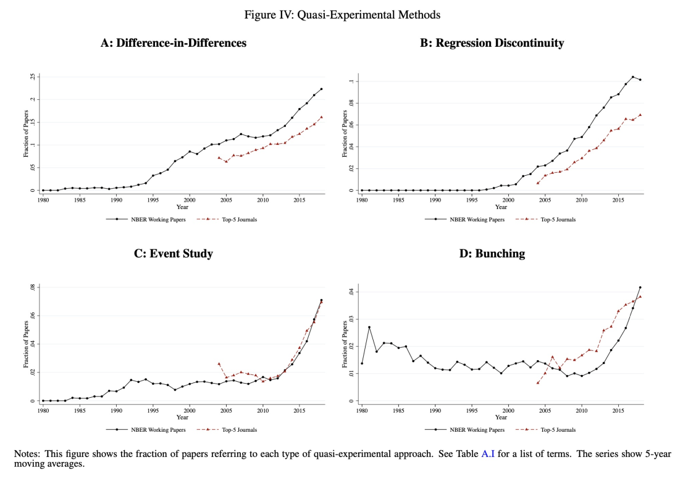

layout: true

<div class="my-footer"></div> 

---

```{r setup, include=FALSE,warning=FALSE,message=FALSE}
options(htmltools.dir.version = FALSE)
knitr::opts_chunk$set(
    echo = FALSE,
    message = FALSE,
    warning = FALSE,
    dev = "svg",
    cache = TRUE,
    fig.align = "center"
    #fig.width = 11,
    #fig.height = 5
)

library(emo)
library(tidyverse)
library(ggplot2)
library(kableExtra)
library(zoo)
library(scales)
library(grid)
library(pBrackets)
library(formattable)

# set seed
set.seed(1234)
```

layout: true

<div class="my-footer"></div> 

---

# Hoje: ***Diferenças-em-diferenças***

* Explora mudanças ao longo do tempo que não afetam a todos

* Necessidade de encontrar (ou construir) grupo de controle apropriado

* *Suposição chave:* tendências paralelas

* *Aplicação empírica*: impacto do ***salário mínimo*** no ***emprego***. Card e Krueger (1994)

* Design de inferência causal mais amplamente utilizado em econometria aplicada
---

```{r quasi-exp, out.height="580px", echo=FALSE}

```

---

# Métodos de avaliação

* A regressão múltipla geralmente não fornece estimativas causais por causa da ***seleção em não observáveis*** (e.g. viés de variável omitida).

--

* Experimentos RCTs são uma maneira de resolver este problema, mas muitas vezes são impossíveis de fazer.

--

* Quatro principais métodos de avaliação causal usados em economia:

   - ***variáveis instrumentais (VI)***,
   - ***pareamento por escore de propensão*** (Propensity Score Matching),
   - ***regressão em descontinuidade (RDD)***
   - ***diferenças-em-diferenças (DID)***, e
   - ***bunching*** chegou atrasado `r emo::ji("mantelpiece_clock")`

--

* Esses métodos são usados para identificar __relações causais__ entre tratamentos e resultados.


---

# Diferenças em Diferenças (DID)

* `r emo::ji("warning")` indivíduos **não são** alocados aleatoriamente ao tratamento 

--

## Requisitos do DID canônico:

--

* 2 períodos de tempo: antes e depois do tratamento.

--

* 2 grupos:

--
  - ***grupo controle:*** nunca recebe tratamento,

--

  - ***grupo de tratamento:*** inicialmente não tratado e depois totalmente tratado.
  
--

* Sob certas suposições, o grupo de controle pode ser usado como contrafactual para o grupo de tratamento

---

# Diferenças em Diferenças (DID)

## Exemplo: Salário Mínimo e Emprego

--

* Imagine que você está interessado em avaliar o impacto __causal__ do aumento do salário mínimo no (des)emprego.

--

* Por que isso não é tão simples? Qual deve ser o grupo de controle?

--

* [Paper](http://davidcard.berkeley.edu/papers/njmin-aer.pdf) seminal em 1994  pelos proeminentes economistas trabalhistas David Card e Alan Krueger intitulado "Minimum Wages and Employment: A Case Study of the Fast-Food Industry in New Jersey and Pennsylvania"

--

* Estima o efeito de um aumento do salário mínimo sobre a taxa de emprego na indústria de fast-food. Por que essa indústria?

---
# Card e Krueger (1994)

## Detalhes Institucionais

* Nos EUA, existe um salário mínimo nacional, mas os estados podem divergir dele.

--

* 1º de abril de 1992: o salário mínimo de Nova Jersey aumenta de US$ 4,25 para US$ 5,05 por hora.

--

* A vizinha Pensilvânia não mudou seu nível de salário mínimo.

--

.pull-left[
```{r, echo = F, out.width = "600px"}
knitr::include_graphics("../../img/photos/nj_penn_map.png")
```
]

--

.pull-right[
<br>
<br>
Pensilvânia e Nova Jersey são ***muito semelhantes***: instituições semelhantes, hábitos semelhantes, consumidores semelhantes, renda semelhante, clima semelhante, etc.]
---

# Card e Krueger (1994)

## Metodologia

* Pesquisados 410 estabelecimentos de fast-food em Nova Jersey (NJ) e leste da Pensilvânia

--

* Tempo:

--
   - Levantamento antes do aumento de SM de NJ: fevereiro/março de 1992

--
   - Levantamento após aumento de SM de NJ: Nov/Dez 1992

--

* Que comparações você acha que eles fizeram?

--

.pull-left[
Vamos dar uma olhada nos dados

```{r, echo = FALSE, eval = TRUE}
# install package that contains the cleaned data
remotes::install_github("b-rodrigues/diffindiff")
library(diffindiff)
ck1994_df <- njmin
```
]

--

.pull-right[
```{r, echo=FALSE}
ck1994_df %>%
  select(sheet,chain,state,observation,empft,emppt) %>%
  head()
```

]
---

# Card e Krueger (1994) 

.pull-left[
## Resultados

.center[__Emprego médio por loja antes e depois do aumento do salário mínimo de NJ__]
```{r, echo = FALSE, eval = TRUE}
# create average of FTE employment by state by survey wage
ck1994 <- ck1994_df %>%
    mutate(empfte = empft + 0.5*emppt + nmgrs) %>%
    group_by(state,observation) %>%
    summarise(mean_fte = mean(empfte, na.rm = T)) |> 
    # change to data.frame format
    as.data.frame(ck1994)

# recode ck1994 to look nice
ck_mw <- data.frame(
  Variable = c("emprego FTE antes","emprego FTE depois","Mudança na média emprego FTE"),
  PA = c(
    ck1994[ck1994$state == "Pennsylvania" & ck1994$observation == "February 1992", "mean_fte"],
    ck1994[ck1994$state == "Pennsylvania" & ck1994$observation == "November 1992", "mean_fte"],
    ck1994[ck1994$state == "Pennsylvania" & ck1994$observation == "November 1992", "mean_fte"] -
      ck1994[ck1994$state == "Pennsylvania" & ck1994$observation == "February 1992", "mean_fte"]),
  NJ = c(
    ck1994[ck1994$state == "New Jersey" & ck1994$observation == "February 1992", "mean_fte"],
    ck1994[ck1994$state == "New Jersey" & ck1994$observation == "November 1992", "mean_fte"],
    ck1994[ck1994$state == "New Jersey" & ck1994$observation == "November 1992", "mean_fte"] -
      ck1994[ck1994$state == "New Jersey" & ck1994$observation == "February 1992", "mean_fte"]))

# present in table form
ck_mw %>%
  mutate(
    PA = round(PA, 2),
    NJ = round(NJ, 2)
  ) %>%
  mutate(
    PA = ifelse(PA<0,
                cell_spec(PA, "html", background = viridis_pal()(2)[2], color = "white", bold = T, align = "c"),
                cell_spec(PA, "html", background = NULL, color = NULL, align = "c")),
    NJ = ifelse(NJ<1,
                cell_spec(NJ, "html", background = viridis_pal()(2)[1], color = "white", bold = T, align = "center"),
                cell_spec(NJ, "html", background = NULL, color = NULL, align = "c"))
  ) %>%
  kable(format = "html", digits = 2, escape = F,
        col.names = c("Variáveis", "Pensilvania", "Nova Jersey")) %>%
  kable_styling("striped", full_width = F)
```
]

--
.pull-right[
## Estimativa de DID

Estimativa causal de diferenças em diferenças: $0,59 - (-2,17) = 2,76$


Interpretação: o aumento do salário mínimo levou a um __aumento__ no emprego FTE por loja de 2,76 em média.


Sim, a essência das diferenças-em-diferenças é _assim_ simples! `r emo::ji("grinning")`

Vejamos esses resultados graficamente.

]

---

# DID graficamente

```{r, echo = F, fig.width = 10, fig.height = 5}
ck_mw <- data.frame(
  date = as.Date(c("010292","010292","011192","011192"), format = "%d%m%y"),
  state = c("Pennsylvania","New Jersey","Pennsylvania","New Jersey"),
  fte_emp = c(23.33,20.44,21.17,21.03)
)

gg_did <- ggplot(ck_mw, aes(x = date, y = fte_emp, color = state)) +
    geom_vline(xintercept = as.Date("010492", format = "%d%m%y"), linetype = "longdash",
               color  = viridis_pal()(3)[2]) +
    geom_vline(xintercept = as.Date("010292", format = "%d%m%y"), linetype = "solid") +
    geom_vline(xintercept = as.Date("011192", format = "%d%m%y"), linetype = "solid") +
    ylim(17,24) +
    scale_x_date(labels = date_format("%h %y"),
                 limits = c(min(ck_mw$date),as.Date("011292", format = "%d%m%y")),
                 date_breaks = "1 month",
                 minor_breaks = NULL) +
    labs(x = NULL, 
         y = "Número médio de funcionários FTE por loja", 
         color = NULL) +
    scale_colour_viridis_d() +
    theme_bw(base_size = 16) + 
    theme(legend.position ="none") +
    annotate("label", x = as.Date("1992-05-28"), y = 23.99,
             label = "Aumento do salário mínimo em Nova Jersey", 
             color =  viridis_pal()(3)[2], size = 4.5) +
    annotate("label", x = as.Date("1992-02-26"), y = 23.99,
             label = "Pesquisa antes", color = "black", size = 4.5) +
    annotate("label", x = as.Date("1992-11-22"), y = 23.99,
             label = "Pesquisa depois", color = "black", size = 4.5)
gg_did
```

---

# DID graficamente

```{r, echo = F, fig.width = 10, fig.height = 5}
gg_did_2 <- gg_did +
    geom_point(size = 3) +
    annotate("label", x = as.Date("1992-03-01"), y = 22.8, 
             label = "Pensilvânia - feb. 92", color = viridis_pal()(2)[2], size = 4) +
    annotate("label", x = as.Date("1992-03-01"), y = 20, 
             label = "Nova Jersey - feb. 92", color = viridis_pal()(2)[1], size = 4) +
    annotate("label", x = as.Date("1992-10-01"), y = 21.75, 
             label = "Pensilvânia - nov. 92", color = viridis_pal()(2)[2], size = 4) +
    annotate("label", x = as.Date("1992-10-01"), y = 20.5, 
             label = "Nov Jersey - nov. 92", color = viridis_pal()(2)[1], size = 4)
gg_did_2
```

---

# DID graficamente

```{r, echo = F, fig.width = 10, fig.height = 5}
gg_did_3 <- gg_did +
    geom_point(size = 3) +
    annotate("label", x = as.Date("1992-05-15"), y = 23, 
             label = "Pensilvânia", color = viridis_pal()(2)[2], size = 4) +
    geom_line(data = ck_mw[ck_mw$state == "Pennsylvania",],
              aes(x = date, y = fte_emp), linetype = "solid")
gg_did_3
```

---

# DID graficamente

```{r, echo = F, fig.width = 10, fig.height = 5}
new_jersey_counterfactual <- data.frame(
    date = as.Date(c("010292","011192"), format = "%d%m%y"),
    state = c("New Jersey","New Jersey"),
    fte_emp = c(20.44, 18.28)
)

gg_did_4 = gg_did_3 +
    geom_line(data = new_jersey_counterfactual, aes(x = date, y = fte_emp), 
              linetype = "longdash") +
    annotate("label", x = as.Date("1992-07-15"), y = 18.5, 
             label = "Contra-factual de Nova Jersey", 
             color = viridis_pal()(2)[1], size = 4.5)
gg_did_4
```

---

# DID graficamente

```{r, echo = F, fig.width = 10, fig.height = 5}
# real path 
new_jersey_real <- data.frame(
    date = as.Date(c("010292","010492","011192"), format = "%d%m%y"),
    state = c("New Jersey","New Jersey","New Jersey"),
    fte_emp = c(20.44, 19.95,21.03)
)

gg_did_5 = gg_did_3 +
    geom_line(data = new_jersey_counterfactual, aes(x = date, y = fte_emp), 
              linetype = "longdash") +
    geom_line(data = new_jersey_real, aes(x = date, y = fte_emp), linetype = "solid") +
    annotate("label", x = as.Date("1992-05-15"), y = 20.75, 
             label = "Nova Jersey", color = viridis_pal()(2)[1], size = 4)
gg_did_5
```

---

# DID graficamente

```{r, echo = F, fig.width = 10, fig.height = 5}
gg_did_5 +
  annotate("text", x = as.Date("1992-11-26"), y = 19.7, 
           label = "Efeito\nTratamento", color = "black", size = 5)
x = 623
ymin = 150
ymax = ymin + 114
grid.brackets(x,
              ymin,
              x,
              ymax,
              h = 0.05, lwd = 1, col = "black")
```

---

# Comparação ingênua depois/antes?

```{r, echo = F, fig.width = 10, fig.height = 5}
gg_did_3 +
  annotate("text", x = as.Date("1992-11-26"), y = 20.9, label = "Efeito\nTratamento\nIngênuo",
           color = "black", size = 5) +
  geom_segment(aes(x = as.Date("010292", format = "%d%m%y"), y = ck_mw[2,"fte_emp"], 
                   xend = as.Date("011192", format = "%d%m%y"), yend = ck_mw[2,"fte_emp"]),
               color = viridis_pal()(2)[1], linetype = "dashed") +
  annotate("label", x = as.Date("1992-06-08"), y = 20.1, 
           label = "Contra-factual Ingênuo de Nova Jersey", 
           color = viridis_pal()(2)[1], size = 5)
x = 623
ymin = 150
ymax = ymin + 24
grid.brackets(x,
              ymin,
              x,
              ymax,
              h = 0.05, lwd = 1, col = "black")

```

---

# Comparação ingênua depois/antes?

```{r, echo = F, fig.width = 10, fig.height = 5}
gg_did_3 +
  geom_line(data = new_jersey_real, aes(x = date, y = fte_emp), linetype = "solid") +
  geom_line(data = new_jersey_counterfactual, aes(x = date, y = fte_emp), 
            linetype = "longdash") +
  geom_segment(aes(x = as.Date("010292", format = "%d%m%y"), y = ck_mw[2,"fte_emp"], 
                   xend = as.Date("011192", format = "%d%m%y"), yend = ck_mw[2,"fte_emp"]),
               color = viridis_pal()(2)[1], linetype = "dashed") +
  annotate("text", x = as.Date("1992-11-26"), y = 21.1, label = "Efeito\nTratamento\nIngênuo",
           color = "black", size = 5) +
  annotate("text", x = as.Date("1992-11-26"), y = 19.45, label = "Efeito\nTratamento\nReal",
           color = "black", size = 5) +
  annotate("label", x = as.Date("1992-09-01"), y = 21.1, 
           label = "Nova Jersey", 
           color = viridis_pal()(2)[1], size = 5) +
  annotate("label", x = as.Date("1992-05-01"), y = 20.75, 
           label = "Contra-factual Ingênuo de Nova Jersey", 
           color = viridis_pal()(2)[1], size = 4) +
  annotate("label", x = as.Date("1992-06-08"), y = 18.75, 
           label = "Contra-factual de Nova Jersey", 
           color = viridis_pal()(2)[1], size = 5)
x = 635
ymin = 150
ymax = ymin+24
grid.brackets(x,
              ymin,
              x,
              ymax,
              h = 0.05, lwd=1, col="black")
x = 623
ymin = 150
ymax = ymin + 114
grid.brackets(x,
              ymin,
              x,
              ymax,
              h = 0.05, lwd = 1, col = "black")

```

---

# Comparação simples NJ/PA?

```{r, echo = F, fig.width = 10, fig.height = 5}
gg_did_3 +
  geom_segment(aes(x = as.Date("010292", format = "%d%m%y"), 
                   y = ck_mw[4,"fte_emp"], 
                   xend = as.Date("011192", format = "%d%m%y"), 
                   yend = ck_mw[4,"fte_emp"]),
               color = viridis_pal()(2)[1], linetype = "dashed") +
  annotate("label", 
           x = as.Date("1992-06-08"), 
           y = 21.5, 
           label = "Contra-factual Ingênuo de Nova Jersey", 
           color = viridis_pal()(2)[1], size = 5) +
  annotate("text", 
           x = as.Date("1992-11-26"), 
           y = 20.9, 
           label = "Efeito\nTratamento\nIngênuo", 
           color = "black", size = 5)
x = 623
ymin = 142
ymax = ymin + 6
grid.brackets(x,
              ymin,
              x,
              ymax,
              h = 0.05, lwd = 1, col = "black")

```

---

# Comparação simples NJ/PA?

```{r, echo = F, fig.width = 10, fig.height = 5}
gg_did_3 +
  geom_segment(aes(x = as.Date("010292", format = "%d%m%y"), 
                   y = ck_mw[4,"fte_emp"], 
                   xend = as.Date("011192", format = "%d%m%y"), 
                   yend = ck_mw[4,"fte_emp"]),
               color = viridis_pal()(2)[1], linetype = "dashed") +
  annotate("label", x = as.Date("1992-06-08"), y = 21.5, 
           label = "Contra-factual Ingênuo de Nova Jersey", 
           color = viridis_pal()(2)[1], size = 4) +
  geom_line(data = new_jersey_real, aes(x = date, y = fte_emp), linetype = "solid") +
  annotate("text", x = as.Date("1992-11-26"), y = 21.1, label = "Efeito\nTratamento\nIngênuo", color = "black", size = 5) +
  annotate("text", x = as.Date("1992-11-26"), y = 19.45, label = "Efeito\nTratamento\nReal", color = "black", size = 5) +
  geom_line(data = new_jersey_counterfactual, aes(x = date, y = fte_emp), 
            linetype = "longdash") +
    annotate("label", x = as.Date("1992-09-01"), y = 20.3, 
           label = "Nova Jersey", 
           color = viridis_pal()(2)[1], size = 5) +
  annotate("label", x = as.Date("1992-06-08"), y = 18.75, 
           label = "Contra-factual de Nova Jersey", 
           color = viridis_pal()(2)[1], size = 5)

x = 623
ymin = 142
ymax = ymin+6
grid.brackets(x,
              ymin,
              x,
              ymax,
              h = 0.05, lwd=1, col="black")
x = 623
ymin = 150
ymax = ymin+114
grid.brackets(x,
              ymin,
              x,
              ymax,
              h = 0.05, lwd=1, col="black")

```

---

layout: false
class: separator, middle

# Estimação

---

layout: true

<div class="my-footer"></div> 

---

# DID em Forma de Regressão

* Na prática, o DID é geralmente estimado em mais de 2 períodos (4 observações)

* Há mais pontos de dados antes e depois da alteração da política

--

3 ingredientes:

--

1. __Variável dummy de tratamento__: $TREAT_s$ onde o subscrito $s$ nos lembra que o tratamento está no nível do estado

--

1. __Variável dummy dos períodos de pós-tratamento__: $POST_t$ onde o subscrito $t$ nos lembra que esta variável varia ao longo do tempo

--

1. __Termo de interação entre os dois__: $TREAT_s \times POST_t$ `r emo::ji("point_right")` o coeficiente neste termo é o **efeito causal** DID!

---

# DID em Forma de Regressão

__Variável dummy de tratamento__
$$
TREAT_s = \begin{cases}\begin{array}{lcl}
0 \quad \text{se } s = \text{Pensilvânia} \\\
1 \quad \text{se } s = \text{Nova Jersey}
\end{array}\end{cases}
$$

--

__Variável dummy pós-tratamento__
$$
POST_t = \begin{cases}\begin{array}{lcl}
0 \quad \text{se } t < \text{1º abril, 1992} \\\
1 \quad \text{se } t \geq \text{1º abril, 1992}
\end{array}\end{cases}
$$

--

__Quais observações correspondem a $TREAT_s \times POST_t = 1$?__

--

* Vamos juntar todos esses ingredientes:
$$EMP_{st} = \alpha + \beta TREAT_s + \gamma POST_t + \delta(TREAT_s \times POST_t) + \varepsilon_{st}$$

---

# Compreendendo a Regressão

$$EMP_{st} = \color{#d96502}\alpha + \color{#027D83}\beta TREAT_s + \color{#02AB0D}\gamma POST_t + \color{#d90502}\delta(TREAT_s \times POST_t) + \varepsilon_{st}$$

--

Temos o seguinte:

--

$\mathbb{E}(EMP_{st} \; | \; TREAT_s = 0, POST_t = 0) = \color{#d96502}\alpha \tag{1}$

--

$\mathbb{E}(EMP_{st} \; | \; TREAT_s = 0, POST_t = 1) = \color{#d96502}\alpha + \color{#02AB0D}\gamma\tag{2}$

--

$\mathbb{E}(EMP_{st} \; | \; TREAT_s = 1, POST_t = 0) = \color{#d96502}\alpha + \color{#027D83}\beta\tag{3}$

--

$\mathbb{E}(EMP_{st} \; | \; TREAT_s = 1, POST_t = 1) = \color{#d96502}\alpha + \color{#027D83}\beta + \color{#02AB0D}\gamma + \color{#d90502}\delta\tag{4}$

--

$$\left[(4)-(3)\right]-\left[(2)-(1)\right] = \color{#d90502}\delta$$

--
$\color{#d90502}\delta$: ***efeito causal*** do aumento do salário mínimo sobre o emprego

---

# Compreendendo a Regressão

$$EMP_{st} = \color{#d96502}\alpha + \color{#027D83}\beta TREAT_s + \color{#02AB0D}\gamma POST_t + \color{#d90502}\delta(TREAT_s \times POST_t) + \varepsilon_{st}$$

Em formato de tabela:


   | Pré  | Pós  | $\Delta$(Pós - Pré)
:-:|:--:|:--:|:--:
Pensilvânia (PA) | $\color{#d96502}\alpha$ | $\color{#d96502}\alpha + \color{#02AB0D}\gamma$ | $\color{#02AB0D}\gamma$
Nova Jersey (NJ) | $\color{#d96502}\alpha + \color{#027D83}\beta$ | $\color{#d96502}\alpha + \color{#027D83}\beta + \color{#02AB0D}\gamma + \color{#d90502}\delta$ | $\color{#02AB0D}\gamma + \color{#d90502}\delta$
$\Delta$(NJ - PA) | $\color{#027D83}\beta$ | $\color{#027D83}\beta + \color{#d90502}\delta$ | $\color{#d90502}\delta$

--

Esta tabela generaliza para outras configurações substituindo *Pensilvânia* por *Controle* e *Nova Jersey* por *Tratamento*
---

layout: false
class: separator, middle

# Identifying Assumptions

---

layout: true

<div class="my-footer"></div> 

---

# Hipótese Crucial DID 

## Tendências Paralelas

> __Hipótese de tendências comuns ou paralelas__: sem qualquer aumento do salário mínimo, a tendência de emprego de fast-food na Pensilvânia teria sido o que deveríamos esperar ver em Nova Jersey.

--

* Esta hipótese afirma que a tendência de emprego de fast-food da Pensilvânia entre fevereiro e novembro de 1992 fornece uma tendência confiável de emprego *contrafactual* que a indústria de fast-food de Nova Jersey *teria experimentado* caso não tivesse aumentado seu salário mínimo.

--

* Impossível validar ou invalidar completamente esta hipótese (não-testável).

* *Verificação intuitiva:* comparar tendências antes da mudança de política e boa argumentação da comparabilidade dos grupos

---

#  Tendências Paralelas: Graficamente

```{r, echo = FALSE, eval = TRUE, fig.width = 10, fig.height = 5}
gg_did_5
```

---

# Verificando a hipótese de tendências paralelas


```{r, echo = F, fig.width = 10, fig.height = 5}
gg_did_trend <- ggplot(ck_mw, aes(x = date, y = fte_emp, color = state)) +
    geom_vline(xintercept = as.Date("010492", format = "%d%m%y"), 
               linetype = "longdash",
               color  = viridis_pal()(3)[2]) +
    geom_vline(xintercept = as.Date("010292", format = "%d%m%y"), 
               linetype = "solid") +
    geom_vline(xintercept = as.Date("011192", format = "%d%m%y"), 
               linetype = "solid") +
    ylim(17,24) +
  scale_x_date(labels = date_format("%h %y"),
               limits = c(as.Date("011091", format = "%d%m%y"),
                          as.Date("011292", format = "%d%m%y")),
               date_breaks = "1 month",
               minor_breaks = NULL) +
  labs(x = NULL, y = "Número médio de funcionários FTE por loja", 
       color = NULL) +
  scale_colour_viridis_d() +
  theme_bw(base_size = 16) + theme(legend.position="none") +
    annotate("label", x = as.Date("1992-05-28"), y = 23.99,
             label = "Aumento do salário mínimo em Nova Jersey",
             color =  viridis_pal()(3)[2], size = 4.5) +
  annotate("label", x = as.Date("1991-12-28"), y = 23.99, 
           label = "Pesquisa antes", color = "black", size = 4.5) +
  annotate("label", x = as.Date("1992-11-23"), y = 23.99, 
           label = "Pesquisa depois", color = "black", size = 4.5)

gg_did_trend +
      geom_point(size = 3) +
    annotate("label", x = as.Date("1992-03-01"), y = 22.8, 
             label = "Pensilvânia - fev. 92", color = viridis_pal()(2)[2], 
             size = 4) +
    annotate("label", x = as.Date("1992-03-01"), y = 20, 
             label = "Nova Jersey - fev. 92", color = viridis_pal()(2)[1], 
             size = 4) +
    annotate("label", x = as.Date("1992-10-01"), y = 21.75, 
             label = "Pensilvânia - nov. 92", color = viridis_pal()(2)[2], 
             size = 4) +
    annotate("label", x = as.Date("1992-10-01"), y = 20.5, 
             label = "Nova Jersey - nov. 92", color = viridis_pal()(2)[1], 
             size = 4) +
  annotate("label", x = as.Date("1992-01-15"), y = 21.5, label = "O que estava acontecendo \nantes de abril de 92?", color = "black", size = 6)
```

---

# Verificando a hipótese de tendências paralelas

```{r, echo = F, fig.width = 10, fig.height = 5}
new_jersey_counterfactual <- data.frame(
    date = as.Date(c("151191","010292","011192"), format = "%d%m%y"),
    state = c("New Jersey","New Jersey","New Jersey"),
    fte_emp = c(21.05489,20.44,18.28)
)

new_jersey_counterfactual_1 <- data.frame(
    date = as.Date(c("151191","010292","010492","011192"), format = "%d%m%y"),
    state = c("New Jersey","New Jersey","New Jersey","New Jersey"),
    fte_emp = c(20.44,20.44,20.44,20.44)
)

new_jersey_counterfactual_2 <- data.frame(
    date = as.Date(c("151191","010292","010492","011192"), format = "%d%m%y"),
    state = c("New Jersey","New Jersey","New Jersey","New Jersey"),
    fte_emp = c(20,20.44,20.77846,21.98564)
)

pennsylvania_before =  data.frame(
    date = as.Date(c("151191","010292"), format = "%d%m%y"),
    state = c("Pennsylvania","Pennsylvania"),
    fte_emp = c(23.94489,23.33))

gg_did_trend +
      annotate("label", x = as.Date("1992-05-15"), y = 23, 
             label = "Pensilvânia", color = viridis_pal()(2)[2], size = 4) +
    geom_line(data = ck_mw[ck_mw$state == "Pennsylvania",],
              aes(x = date, y = fte_emp), linetype = "solid") +
  geom_point(size = 3) +
  geom_line(data = pennsylvania_before, aes(x = date, y = fte_emp), 
            linetype = "longdash",color = viridis_pal()(2)[2]) +
  geom_line(data = new_jersey_counterfactual, aes(x = date, y = fte_emp), 
            linetype = "longdash") +
  geom_line(data = new_jersey_counterfactual_1, aes(x = date, y = fte_emp), 
            linetype = "longdash") +
  geom_line(data = new_jersey_counterfactual_2, aes(x = date, y = fte_emp), 
            linetype = "longdash") +
  annotate("label", x = as.Date("1992-05-15"), y = 19, label = "Nova Jersey possíveis contrafactuais", color = viridis_pal()(2)[1], size = 4)

```

---

# Hipótese de tendências paralelas $\rightarrow$ Verificada `r emo::ji("white_check_mark")`

```{r, echo = F, fig.width = 10, fig.height = 5}
gg_did_trend_val <- gg_did_trend +
  geom_line(data = pennsylvania_before, aes(x = date, y = fte_emp), 
            linetype = "longdash",color = viridis_pal()(2)[2]) +
  annotate("label", x = as.Date("1992-05-15"), y = 23, 
             label = "Pensilvânia", color = viridis_pal()(2)[2], size = 4) +
  geom_line(data = ck_mw[ck_mw$state == "Pennsylvania",],
              aes(x = date, y = fte_emp), linetype = "solid") +
  geom_point(size = 3) +
  geom_line(data = new_jersey_counterfactual, aes(x = date, y = fte_emp), 
            linetype = "longdash") +
  geom_line(data = new_jersey_real, aes(x = date, y = fte_emp), 
            linetype = "solid")  +
  annotate("label", x = as.Date("1992-05-15"), y = 19, 
           label = "Nova Jersey contrafactual", 
           color = viridis_pal()(2)[1], size = 4) +
    annotate("label", x = as.Date("1992-05-15"), y = 20.75, 
             label = "Nova Jersey", 
             color = viridis_pal()(2)[1], size = 4) +
    annotate("rect", xmin=as.Date("011091", format = "%d%m%y"),
             xmax=as.Date("010492", format = "%d%m%y"), 
             ymin=20 , ymax=23.5, 
             alpha=0.4, color="#21908CFF", fill="#21908CFF") +
  annotate("text", x=as.Date("011291", format = "%d%m%y"), y=22, 
           label = "Tendências de Emprego\nsão similares", 
           color = "black", size = 5)
gg_did_trend_val

```

---

# Hipótese de tendências paralelas $\rightarrow$ Verificada `r emo::ji("white_check_mark")`

```{r, echo = F, fig.width = 10, fig.height = 5}
gg_did_trend_val +
    geom_line(data = new_jersey_counterfactual, aes(x = date, y = fte_emp), 
              linetype = "dashed", color = viridis_pal()(2)[2]) +
    annotate("label", x = as.Date("1992-07-15"), y = 18.5,
             label = "Nova Jersey DID Contrafactual", 
             color = viridis_pal()(2)[2], size = 4.5) +
    annotate("text", x = as.Date("1992-11-28"), y = 19.6, 
             label = "Efeito\nTratamento\nReal\n=\nEfeito\nTratamento\nDID",
             color = "black", size = 4)

x = 640
ymin = 150
ymax = ymin+114
grid.brackets(x,
              ymin,
              x,
              ymax,
              h = 0.05, lwd=1, col="black")
```

---

# Hipótese de tendências paralelas $\rightarrow$ Não verificada `r emo::ji("x")`

```{r, echo = F, fig.width = 10, fig.height = 5}

new_jersey_real_2 <- data.frame(
    date = as.Date(c("010292","010492","011192"), format = "%d%m%y"),
    state = c("New Jersey","New Jersey","New Jersey"),
    fte_emp = c(20.44,20.77846,21.03)
)

gg_did_trend_not_val = gg_did_trend +
  geom_line(data = pennsylvania_before, aes(x = date, y = fte_emp), 
            linetype = "longdash",color = viridis_pal()(2)[2]) +
  annotate("label", x = as.Date("1992-05-15"), y = 23, 
             label = "Pensilvânia", color = viridis_pal()(2)[2], size = 4) +
  geom_line(data = ck_mw[ck_mw$state == "Pennsylvania",],
              aes(x = date, y = fte_emp), linetype = "solid") +
  geom_point(size = 3) +
  geom_line(data = new_jersey_counterfactual_2, aes(x = date, y = fte_emp), 
            linetype = "longdash") +
  geom_line(data = new_jersey_real_2, aes(x = date, y = fte_emp), 
            linetype = "solid")  +
  annotate("label", x = as.Date("1992-05-01"), y = 21.6, 
           label = "Nova Jersey contrafactual", 
           color = viridis_pal()(2)[1], size = 4) +
    annotate("label", x = as.Date("1992-05-15"), y = 20.4, 
             label = "Nova Jersey", 
             color = viridis_pal()(2)[1], size = 4) +
    annotate("rect", xmin=as.Date("011091", format = "%d%m%y"),
             xmax=as.Date("010492", format = "%d%m%y"), 
             ymin=20 , ymax=23.5, 
             alpha=0.4, color="#21908CFF", fill="#21908CFF") +
  annotate("text", x=as.Date("011291", format = "%d%m%y"), y=22, 
           label = "Tendências de Emprego\nnão são similares", 
           color = "black", size = 5)
gg_did_trend_not_val
```

---

# Hipótese de tendências paralelas $\rightarrow$ Não verificada `r emo::ji("x")`

```{r, echo = F, fig.width = 10, fig.height = 5}
gg_did_trend_not_val + 
  geom_line(data = pennsylvania_before, aes(x = date, y = fte_emp), 
            linetype = "longdash",color = viridis_pal()(2)[2]) +
  geom_line(data = new_jersey_counterfactual, aes(x = date, y = fte_emp), 
              linetype = "longdash", color = viridis_pal()(2)[2]) +
  annotate("label", x = as.Date("1992-07-15"), y = 18.5, 
             label = "Nova Jersey DID Contrafactual", 
             color = viridis_pal()(2)[2], size = 4.5) +
  annotate("text", x = as.Date("1992-11-28"), y = 19.45, 
           label = "Efeito\nTratamento\nDID", color = "black", size = 4) +
  annotate("text", x = as.Date("1992-11-28"), y = 21.4, 
           label = "Efeito\nTratamento\nReal", color = "black", size = 4)

x = 640
ymin = 108
ymax = ymin+42
grid.brackets(x,
              ymin,
              x,
              ymax,
              h = 0.05, lwd=1, col="black")
x = 640
ymin = 150
ymax = ymin+114
grid.brackets(x,
              ymin,
              x,
              ymax,
              h = 0.05, lwd=1, col="black")
```

---

# Hipótese de Tendências Paralelas: [Card and Krueger (2000)](https://inequality.stanford.edu/sites/default/files/media/_media/pdf/Reference%20Media/Card%20and%20Krueger_2000_Policy.pdf)

Aqui estão as tendências reais para a Pensilvânia e Nova Jersey

```{r, echo = F, out.width = "600px"}
knitr::include_graphics("../../img/photos/min_wage_parallel_trends.png")
```

--

.right-wide[
* É provável que a hipótese de tendência comum seja verificada?
]
---

# Hipótese de Tendências Paralelas: formalmente

* $Y_{ist}^1$: emprego no restaurante $i$ no estado $s$ no momento $t$ quando SM estadual alto (resultado potencial tratado);

--
* $Y_{ist}^0$: emprego no restaurante $i$ no estado $s$ no momento $t$ quando SM baixo no estado (resultado potencial não tratado);

--

O principal pressuposto subjacente à estimativa de DID é que, **no estado sem tratamento**, o resultado do restaurante $i$ no estado $s$ no momento $t$ é dado por:

$$\mathbb{E}[Y_{ist}^0|s,t] = \gamma_s + \lambda_t$$

Duas suposições implícitas:

1. ***Viés de seleção***: refere-se a características de estado fixo $(\gamma)$

2. ***Tendência temporal***: mesma tendência temporal para grupos tratamento e controle $(\lambda)$

---

# Hipótese de Tendências Paralelas: formalmente

Resultados no grupo de comparação:

$$\mathbb{E}[Y_{ist}| s = \text{Pensilvânia},t = \text{Fev}] = \gamma_{PA} + \lambda_{Fev}$$
--

$$\mathbb{E}[Y_{ist}|s = \text{Pensilvânia},t = \text{Nov}] = \gamma_{PA} + \lambda_{Nov}$$

--

$$
\begin{align}
\mathbb{E}[Y_{ist}|s &= \text{Pensilvânia},t = \text{Nov}] - \mathbb{E}[Y_{ist}| s = \text{Pensilvânia},t = \text{Fev}] \\
&= \gamma_{PA} + \lambda_{Nov} - (\gamma_{PA} + \lambda_{Fev}) \\
&= \underbrace{\lambda_{Nov} - \lambda_{Fev}}_{\text{tendência temporal}}
\end{align}
$$

--

`r emo::ji("right_arrow")` o grupo de comparação permite estimar a ***tendência temporal***.

---

# Hipótese de Tendências Paralelas: formalmente

Seja $\delta$ o verdadeiro impacto do aumento do salário mínimo:

$$\mathbb{E}[Y_{ist}^1 - Y_{ist}^0|s,t] := \delta$$

--

Resultados no grupo de tratamento:

$$\mathbb{E}[Y_{ist}|s = \text{Nova Jersey}, t = \text{Fev}] = \gamma_{NJ} + \lambda_{Fev}$$
--

$$\mathbb{E}[Y_{ist}|s = \text{Nova Jersey}, t = \text{Nov}] = \gamma_{NJ} + \delta + \lambda_{Nov}$$
--

$$
\begin{align}
\mathbb{E}[Y_{ist}|s &= \text{Nova Jersey}, t = \text{Nov}] - \mathbb{E}[Y_{ist}|s = \text{Nova Jersey}, t = \text{Fev}] \\
&= \gamma_{NJ} + \delta + \lambda_{Nov} - (\gamma_{NJ} + \lambda_{Feb}) \\
&= \delta + \underbrace{\lambda_{Nov} - \lambda_{Feb}}_{\text{tendência temporal}}
\end{align}
$$

---

# Hipótese de Tendências Paralelas: formalmente

Portanto nós temos que:

$$
\begin{align}
\mathbb{E}[Y_{ist}&|s = \text{PA},t = \text{Nov}] - \mathbb{E}[Y_{ist}| s = \text{PA},t = \text{Fev}] = \underbrace{\lambda_{Nov} - \lambda_{Feb}}_{\text{time trend}}
\end{align}
$$

--

$$
\begin{align}
\mathbb{E}[Y_{ist}&|s = \text{NJ},t = \text{Nov}] - \mathbb{E}[Y_{ist}| s = \text{NJ},t = \text{Fev}] = \delta + \underbrace{\lambda_{Nov} - \lambda_{Feb}}_{\text{time trend}}
\end{align}
$$

--

$$
\begin{align}
DID &= \mathbb{E}[Y_{ist}|s = \text{NJ}, t = \text{Nov}] - \mathbb{E}[Y_{ist}|s = \text{NJ}, t = \text{Fev}] \\
& \qquad \qquad - \Big(\mathbb{E}[Y_{ist}|s = \text{PA},t = \text{Nov}] - \mathbb{E}[Y_{ist}| s = \text{PA},t = \text{Fev}]\Big) \\
&= \delta + \lambda_{Nov} - \lambda_{Feb} - (\lambda_{Nov} - \lambda_{Feb}) \\
&= \delta
\end{align}
$$

---
# Leitura Recomendada

* GERTLER, Paul J. et al. Avaliação de Impacto na Prática, 2018. - 2. ed. Banco Mundial. Capítulo 7 Diferenças em diferenças

* ANGRIST, Joshua D.; PISCHKE, Jörn-Steffen. Mostly harmless econometrics: An empiricist's companion. Princeton university press, 2009. Section 5.2 Differences-in-differences

* CUNNINGHAM, Scott. Causal Inference: The Mixtape, New Haven: Yale University Press, 2021. URL: https://mixtape.scunning.com/. Chapter 9 Difference-in-differences

---

layout: false

class: title-slide-final, middle
background-image: url(../../img/logo/UdescEsag.jpeg)
background-size: 350px
background-position: 9% 19%

# ATÉ A PRÓXIMA AULA!

Com a Lista 5 feita! `r emo::ji("white_check_mark")`

.footnote[
[1]: Este slides foram baseados nas aulas de econometria da [SciencesPo Department of Economics](https://github.com/ScPoEcon/ScPoEconometrics-Slides)
]


|                                                                                                            |                                   |
| :--------------------------------------------------------------------------------------------------------- | :-------------------------------- |
| <a href="https://github.com/rfbressan/econometria3_slides">.ScPored[<i class="fa fa-link fa-fw"></i>] | Slides |
| <a href="http://github.com/rfbressan">.ScPored[<i class="fa fa-github fa-fw"></i>]                          | @rfbressan                      |
| <a href="https://raw.githack.com/rfbressan/econometria3_slides/master/lectures/07-DID/lista_V_pt.html">.ScPored[<i class="fa fa-list fa-fw"></i>] | Lista de Exercícios V |

